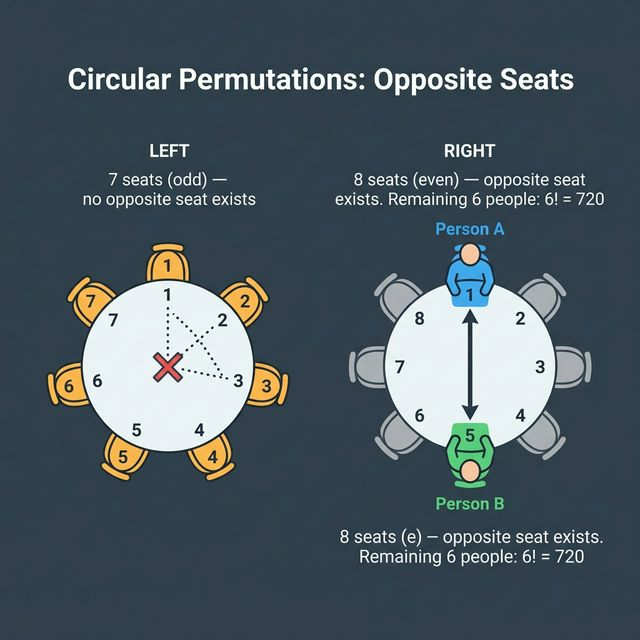

# Solution — Task 4: Circular Permutations

## 1. 7 people around a round table

Circular permutation of 7 distinct objects:

$$(7 - 1)! = 6! = 720$$

## 2. Two particular people must sit next to each other

Treat the two people as a single block → **6 objects** around a circle.

The block can be internally arranged in $2$ ways (A-B or B-A).

$$(6 - 1)! \cdot 2 = 5! \cdot 2 = 120 \cdot 2 = 240$$

## 3. Two particular people must sit opposite each other

At a round table with 7 seats, there is **no seat directly opposite** another seat (7 is odd — opposite seats only exist for even numbers).

Therefore, **this arrangement is impossible** and the answer is:

$$0$$

### Bonus: What if there were 8 people?

With **8 seats** around a round table, each seat has exactly one seat directly opposite.

- Fix person A at any seat (removes rotational symmetry) → **1 way**
- Person B must sit directly opposite A → **1 way**
- The remaining **6 people** fill the remaining 6 seats freely → $6!$ ways

$$1 \cdot 1 \cdot 6! = 720$$

