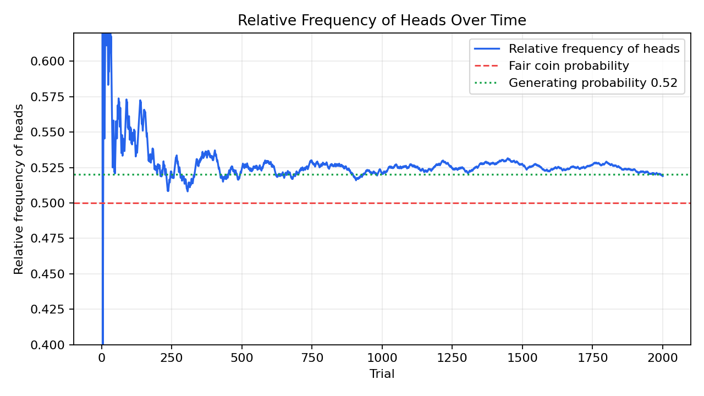

# Problem 2 — Coin Tosses and Relative Frequencies

## Generated files

- Dataset: [`problem_02_coin_tosses.csv`](problem_02_coin_tosses.csv)
- Frequency table: [`frequency_table.csv`](frequency_table.csv)
- Relative frequency checkpoints: [`relative_frequency_checkpoints.csv`](relative_frequency_checkpoints.csv)
- Plot: [`relative_frequency_heads.png`](relative_frequency_heads.png)

## Description of the data

The dataset represents 2000 repeated coin tosses. One row corresponds to one toss. The column `trial` gives the toss number, `result` records whether the outcome was heads (`H`) or tails (`T`), and `is_head` marks whether the outcome was heads.

The columns `cumulative_heads` and `relative_frequency_heads` show how many heads have appeared up to a given trial and what proportion of all tosses so far were heads.

## Frequency table

| Result | Absolute frequency | Relative frequency |
| :----: | -----------------: | -----------------: |
| H | 1038 | 0.519 |
| T | 962 | 0.481 |

The final empirical relative frequency of heads is:

$$
\frac{1038}{2000}=0.519.
$$

The final empirical relative frequency of tails is:

$$
\frac{962}{2000}=0.481.
$$

## Relative frequency over time

| Trial | Cumulative heads | Relative frequency of heads |
| ----: | ---------------: | --------------------------: |
| 10 | 6 | 0.600 |
| 20 | 13 | 0.650 |
| 50 | 27 | 0.540 |
| 100 | 55 | 0.550 |
| 200 | 105 | 0.525 |
| 500 | 262 | 0.524 |
| 1000 | 521 | 0.521 |
| 2000 | 1038 | 0.519 |

## Interpretation

At the beginning, the relative frequency of heads changes strongly because each new toss has a large effect on the total proportion. After more tosses, the relative frequency becomes more stable.

The final relative frequency of heads is 0.519. This is above 0.5, but the difference is not large. However, the data were generated with probability 0.52 for heads, so the final empirical value is very close to the generating probability.

Based on these generated data, the coin does not appear to be exactly fair. Heads occur slightly more often than tails. Still, empirical data alone always contain random variation, so the conclusion should be stated carefully.

The theoretical probability is the probability assumed by the model before observing the data. The empirical relative frequency is computed from the observed results. With many trials, the empirical relative frequency often gets close to the theoretical probability, but it does not have to be exactly equal to it.
