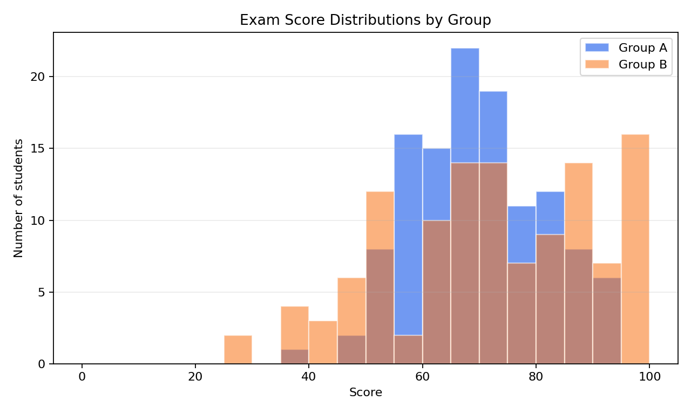
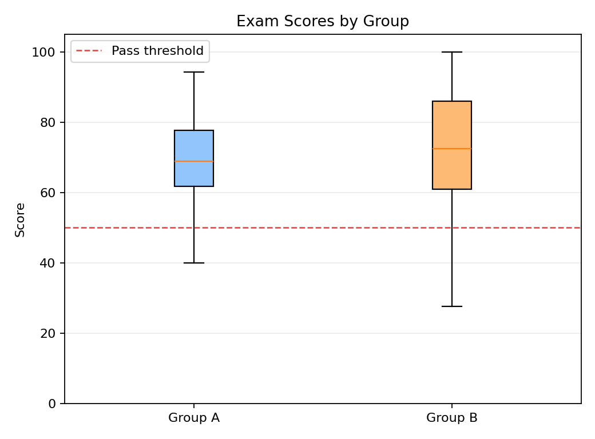

# Problem 3 — Exam Scores in Two Groups

## Generated files

- Dataset: [`problem_03_exam_scores.csv`](problem_03_exam_scores.csv)
- Overall summary: [`overall_score_summary.csv`](overall_score_summary.csv)
- Group summaries: [`score_summary_by_group.csv`](score_summary_by_group.csv)
- Pass rates: [`pass_rate_by_group.csv`](pass_rate_by_group.csv)
- Histograms: [`score_histograms_by_group.png`](score_histograms_by_group.png)
- Boxplots: [`score_boxplots_by_group.png`](score_boxplots_by_group.png)

## Description of the data

One row represents one student who wrote the exam. The column `student_id` identifies the student, `group` shows whether the student belongs to group A or group B, `score` gives the exam result, and `passed` indicates whether the score is at least 50.

The dataset contains 240 students: 120 in group A and 120 in group B.

## Overall score summary

| Mean | Median | Minimum | Maximum | Variance | Standard deviation |
| ---: | -----: | ------: | ------: | -------: | -----------------: |
| 71.128 | 70.400 | 27.600 | 100.000 | 230.744 | 15.190 |

## Score summary by group

| Group | Mean | Median | Minimum | Maximum | Variance | Standard deviation |
| :---: | ---: | -----: | ------: | ------: | -------: | -----------------: |
| A | 69.849 | 68.900 | 39.900 | 94.200 | 132.194 | 11.498 |
| B | 72.406 | 72.450 | 27.600 | 100.000 | 327.937 | 18.109 |

## Pass rates

| Group | Passed students | Total students | Pass rate |
| :---: | --------------: | -------------: | --------: |
| A | 117 | 120 | 0.975 |
| B | 105 | 120 | 0.875 |

## Plots

## Interpretation

Group B has the higher mean score: 72.406 compared with 69.849 for group A. Group B also has the higher median score: 72.450 compared with 68.900.

However, group B has a much larger standard deviation: 18.109 compared with 11.498 for group A. This means that scores in group B are more spread out. The minimum score in group B is also much lower than in group A, while the maximum score reaches 100.

The pass rate gives a different perspective. Group A has a pass rate of 0.975, while group B has a pass rate of 0.875. So although group B has the higher average score, group A has more consistent results and fewer students below the pass threshold.

Comparing only the means would be misleading because it would hide the larger variability in group B. Group B seems stronger among high-scoring students, but it also contains more weak results. Group A performed more consistently overall.

A balanced conclusion is that group B achieved the higher typical score by mean and median, but group A had the better pass rate and lower variability. Which group performed better depends on whether the main criterion is high average performance or reliable performance across most students.
