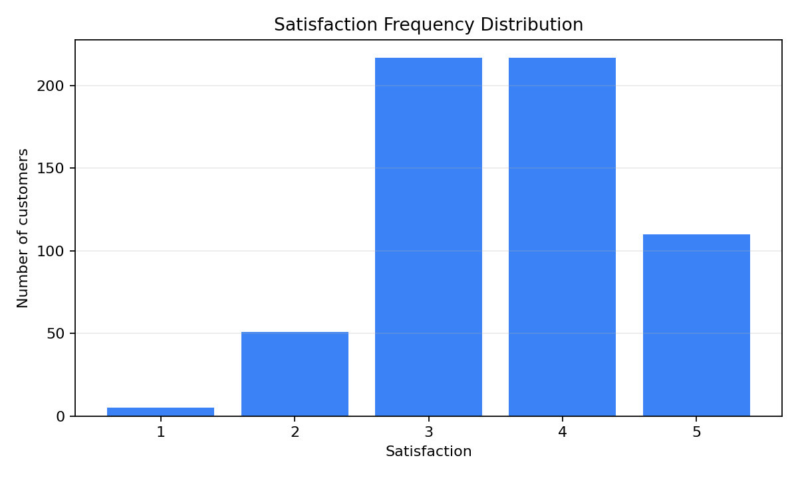
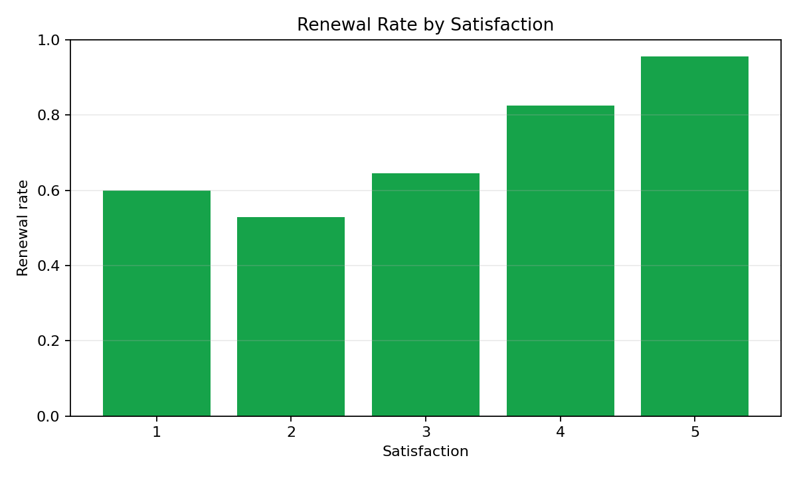
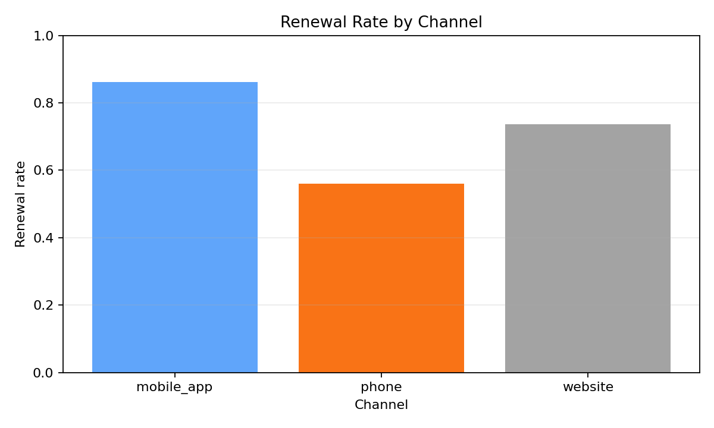

# Problem 5 — Customer Survey and Conditional Frequencies

## Generated files

- Dataset: [`problem_05_customer_survey.csv`](problem_05_customer_survey.csv)
- Frequency tables:
  - [`frequency_age_group.csv`](frequency_age_group.csv)
  - [`frequency_channel.csv`](frequency_channel.csv)
  - [`frequency_satisfaction.csv`](frequency_satisfaction.csv)
  - [`frequency_renewed.csv`](frequency_renewed.csv)
- Overall renewal summary: [`overall_renewal_summary.csv`](overall_renewal_summary.csv)
- Renewal by channel: [`renewal_rate_by_channel.csv`](renewal_rate_by_channel.csv)
- Renewal by satisfaction: [`renewal_rate_by_satisfaction.csv`](renewal_rate_by_satisfaction.csv)
- Plots:
  - [`satisfaction_frequency_bar.png`](satisfaction_frequency_bar.png)
  - [`renewal_rate_by_satisfaction.png`](renewal_rate_by_satisfaction.png)
  - [`renewal_rate_by_channel.png`](renewal_rate_by_channel.png)

## Description of the data

One row represents one surveyed customer. The dataset records the customer's age group, contact channel, satisfaction score from 1 to 5, and whether the customer renewed the subscription.

The dataset contains 600 customers.

## Frequency tables

### Age group

| Age group | Frequency | Relative frequency |
| :-------- | --------: | -----------------: |
| 18-25 | 114 | 0.190 |
| 26-40 | 231 | 0.385 |
| 41-60 | 186 | 0.310 |
| 60+ | 69 | 0.115 |

### Channel

| Channel | Frequency | Relative frequency |
| :------ | --------: | -----------------: |
| mobile_app | 225 | 0.375 |
| phone | 91 | 0.152 |
| website | 284 | 0.473 |

### Satisfaction

| Satisfaction | Frequency | Relative frequency |
| -----------: | --------: | -----------------: |
| 1 | 5 | 0.008 |
| 2 | 51 | 0.085 |
| 3 | 217 | 0.362 |
| 4 | 217 | 0.362 |
| 5 | 110 | 0.183 |

### Renewed

| Renewed | Frequency | Relative frequency |
| :------ | --------: | -----------------: |
| False | 146 | 0.243 |
| True | 454 | 0.757 |

## Renewal rates

The overall renewal rate is:

$$
P(\text{renewed}) = 0.757.
$$

### By channel

| Channel | Renewed customers | Total customers | Renewal rate |
| :------ | ----------------: | --------------: | -----------: |
| mobile_app | 194 | 225 | 0.862 |
| phone | 51 | 91 | 0.560 |
| website | 209 | 284 | 0.736 |

### By satisfaction

| Satisfaction | Renewed customers | Total customers | Renewal rate |
| -----------: | ----------------: | --------------: | -----------: |
| 1 | 3 | 5 | 0.600 |
| 2 | 27 | 51 | 0.529 |
| 3 | 140 | 217 | 0.645 |
| 4 | 179 | 217 | 0.825 |
| 5 | 105 | 110 | 0.955 |

## Conditional probabilities

The probability that a customer renewed given satisfaction 5 is:

$$
P(\text{renewed}\mid \text{satisfaction}=5)=0.955.
$$

The probability that a renewed customer had satisfaction 5 is:

$$
P(\text{satisfaction}=5\mid \text{renewed})=0.231.
$$

These probabilities answer different questions. The first one looks only at customers with satisfaction 5 and asks how many of them renewed. The second one looks only at customers who renewed and asks how many of them had satisfaction 5.

## Plots

## Interpretation

The data suggest a clear relationship between satisfaction and renewal. The renewal rate rises from 0.529 for satisfaction 2 to 0.955 for satisfaction 5. Satisfaction 1 has only 5 observations, so its renewal rate should be interpreted carefully.

The renewal rate is also different across channels. The mobile app has the highest renewal rate, 0.862, while phone has the lowest, 0.560.

This problem is related to conditional probability because many of the main summaries are computed after restricting the dataset to a subgroup. For example, the renewal rate among customers with satisfaction 5 is an empirical conditional probability.
