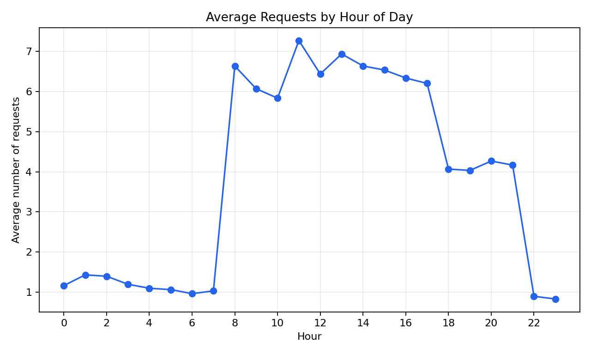
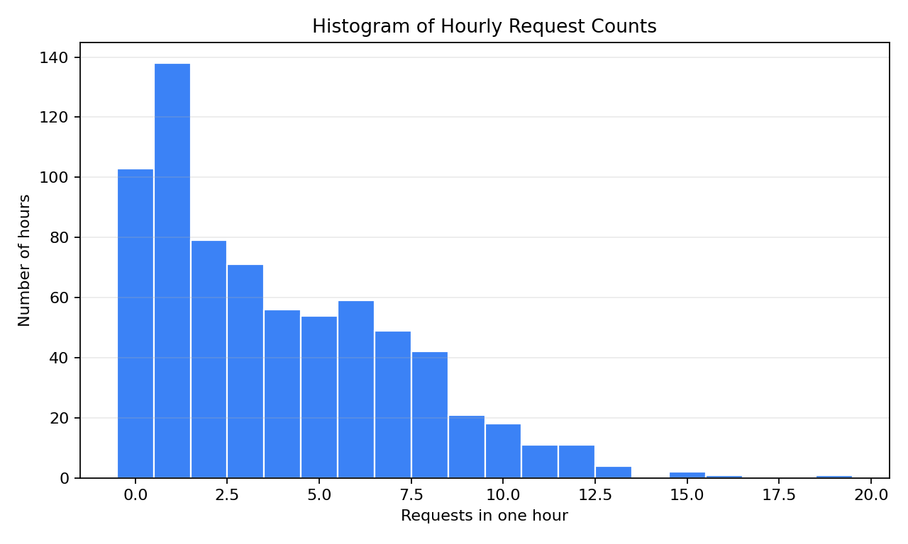
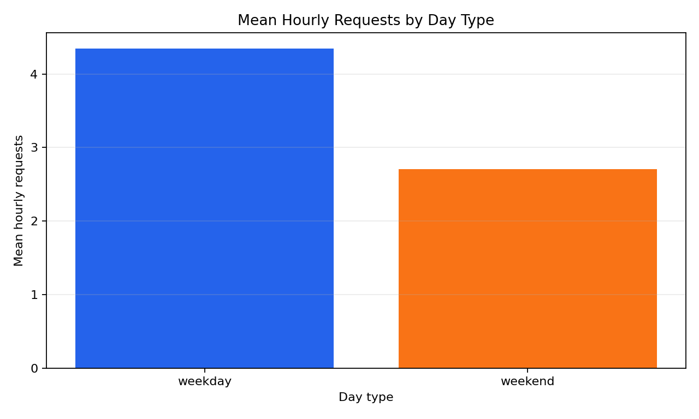

# Problem 7 — Call Center Requests Over Time

## Generated files

- Dataset: [`problem_07_call_center_requests.csv`](problem_07_call_center_requests.csv)
- Overall hourly summary: [`hourly_requests_summary.csv`](hourly_requests_summary.csv)
- Day-type summary: [`requests_summary_by_day_type.csv`](requests_summary_by_day_type.csv)
- Average requests by hour: [`average_requests_by_hour.csv`](average_requests_by_hour.csv)
- Daily totals: [`daily_total_requests.csv`](daily_total_requests.csv)
- Daily total summary: [`daily_total_summary_by_day_type.csv`](daily_total_summary_by_day_type.csv)
- Plots:
  - [`average_requests_by_hour.png`](average_requests_by_hour.png)
  - [`hourly_requests_histogram.png`](hourly_requests_histogram.png)
  - [`mean_hourly_requests_by_day_type.png`](mean_hourly_requests_by_day_type.png)

## Description of the data

One row represents one hour in the call center. The dataset records the date, whether the day was a weekday or weekend, the hour of day, and the number of customer requests received during that hour.

The dataset contains 720 hourly observations, because it covers 30 days and 24 hours per day.

## Overall hourly summary

| Number of hours | Mean hourly requests | Variance | Standard deviation | Minimum | Maximum |
| --------------: | -------------------: | -------: | -----------------: | ------: | ------: |
| 720 | 3.8542 | 11.1484 | 3.3389 | 0 | 19 |

The empirical variance is much larger than the empirical mean. This is important because a single Poisson distribution has equal theoretical mean and variance.

## Comparison by day type

| Day type | Number of hours | Mean | Variance | Standard deviation | Minimum | Maximum |
| :------- | --------------: | ---: | -------: | -----------------: | ------: | ------: |
| weekday | 504 | 4.3452 | 12.9700 | 3.6014 | 0 | 19 |
| weekend | 216 | 2.7083 | 5.0541 | 2.2481 | 0 | 9 |

Weekdays have more requests on average than weekends. Weekdays also have higher variability.

## Daily totals

| Day type | Number of days | Mean daily total | Variance | Standard deviation | Minimum | Maximum |
| :------- | -------------: | ---------------: | -------: | -----------------: | ------: | ------: |
| weekday | 21 | 104.2857 | 100.8143 | 10.0406 | 86 | 124 |
| weekend | 9 | 65.0000 | 91.7500 | 9.5786 | 56 | 85 |

## Plots

## Interpretation

The average number of requests is clearly different across hours of the day. The line plot shows low activity during the night and higher activity during working hours. This pattern agrees with the way the data were generated.

Weekdays are busier than weekends. The mean hourly number of requests is 4.3452 on weekdays and 2.7083 on weekends. Daily totals show the same pattern: weekday daily totals average 104.2857 requests, while weekend daily totals average 65.0000 requests.

This dataset is related to the Poisson distribution because each hourly count is generated as a count of events occurring in a fixed time interval. That is a typical setting for Poisson models.

However, the whole dataset should not be treated as one identical Poisson distribution. The request rate changes with the hour of day and with the day type. The complete dataset is a mixture of different situations, not repeated observations from one fixed-rate process. This explains why the overall empirical variance is much larger than the overall empirical mean.
