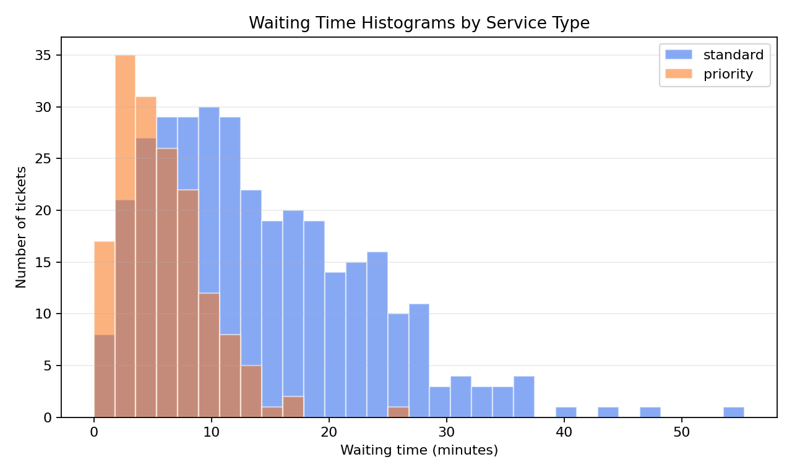
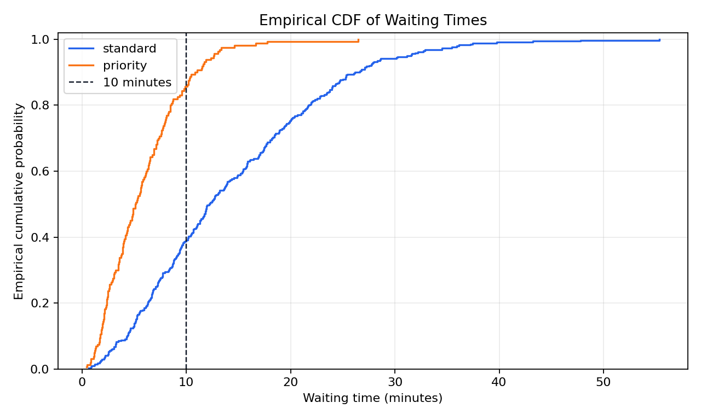
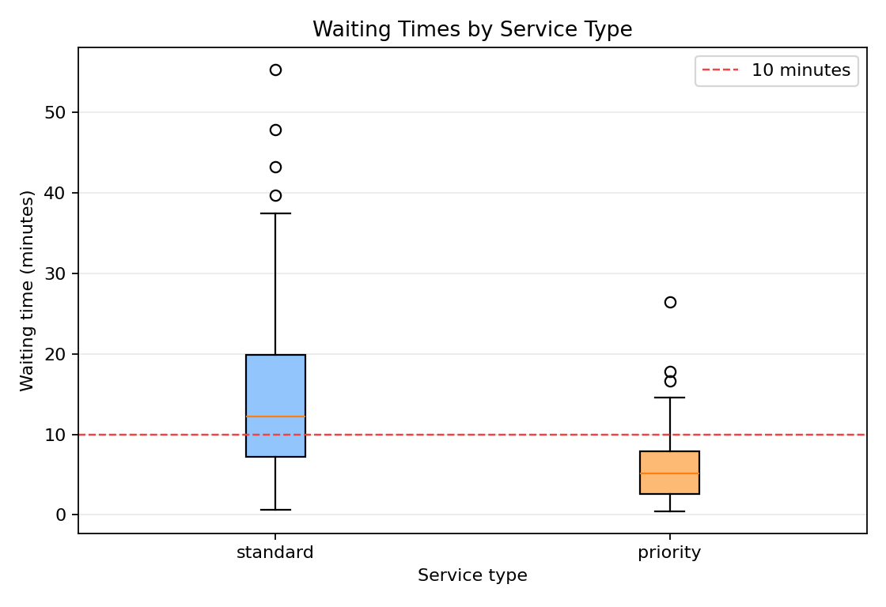

# Problem 8 — Waiting Times and Empirical CDF

## Generated files

- Dataset: [`problem_08_waiting_times.csv`](problem_08_waiting_times.csv)
- Overall summary: [`waiting_time_summary_overall.csv`](waiting_time_summary_overall.csv)
- Service-type summary: [`waiting_time_summary_by_service_type.csv`](waiting_time_summary_by_service_type.csv)
- ECDF probability estimates: [`ecdf_probability_estimates.csv`](ecdf_probability_estimates.csv)
- Quantiles by service type: [`waiting_time_quantiles_by_service_type.csv`](waiting_time_quantiles_by_service_type.csv)
- Plots:
  - [`waiting_time_histograms_by_service_type.png`](waiting_time_histograms_by_service_type.png)
  - [`waiting_time_ecdf_by_service_type.png`](waiting_time_ecdf_by_service_type.png)
  - [`waiting_time_boxplot_by_service_type.png`](waiting_time_boxplot_by_service_type.png)

## Description of the data

One row represents one service ticket. The dataset records the ticket identifier, service type, waiting time in minutes, and whether the ticket was resolved within 10 minutes.

The dataset contains 500 tickets.

## Overall summary

| Tickets | Mean | Median | Q1 | Q3 | Standard deviation | Minimum | Maximum | Resolved under 10 min |
| ------: | ---: | -----: | -: | -: | -----------------: | ------: | ------: | --------------------: |
| 500 | 11.5661 | 9.2000 | 5.0825 | 16.7275 | 8.7133 | 0.4600 | 55.3400 | 0.5380 |

Overall, 53.8% of tickets were resolved within 10 minutes.

## Summary by service type

| Service type | Tickets | Mean | Median | Q1 | Q3 | Standard deviation | Resolved under 10 min |
| :----------- | ------: | ---: | -----: | -: | -: | -----------------: | --------------------: |
| priority | 160 | 5.8512 | 5.1250 | 2.6475 | 7.9425 | 3.9044 | 0.8562 |
| standard | 340 | 14.2555 | 12.2400 | 7.1850 | 19.9025 | 9.0519 | 0.3882 |

Priority tickets have much shorter waiting times than standard tickets. The median waiting time is 5.125 minutes for priority service and 12.240 minutes for standard service.

## Empirical CDF estimates

| Event | Empirical probability |
| :---- | --------------------: |
| Waiting time <= 5 | 0.244 |
| Waiting time <= 10 | 0.538 |
| Waiting time > 20 | 0.170 |

These values are empirical probabilities computed directly from the observed data.

## Quantiles by service type

| Service type | Q10 | Q25 | Q50 | Q75 | Q90 |
| :----------- | --: | --: | --: | --: | --: |
| priority | 1.767 | 2.6475 | 5.125 | 7.9425 | 10.841 |
| standard | 4.394 | 7.1850 | 12.240 | 19.9025 | 26.206 |

The quantiles show that priority service is faster across almost the whole distribution, not only on average.

## Plots

## Interpretation

Waiting-time data are right-skewed. Most tickets have moderate waiting times, but some tickets take much longer. These large values pull the mean upward, especially for standard service.

The empirical CDF shows, for each time value, the proportion of tickets with waiting time less than or equal to that value. For example, the empirical probability of waiting at most 10 minutes is 0.538 overall. The ECDF is useful because it makes it easy to read probabilities such as \(P(T \le 10)\).

A histogram shows how observations are distributed across intervals. An empirical CDF shows cumulative proportions. Both describe the same data, but they emphasize different aspects of the distribution.

This task connects to the theoretical CDF because the empirical CDF is a data-based approximation of a cumulative distribution function. A theoretical CDF gives probabilities from a probability model, while the empirical CDF estimates them from observed data.
