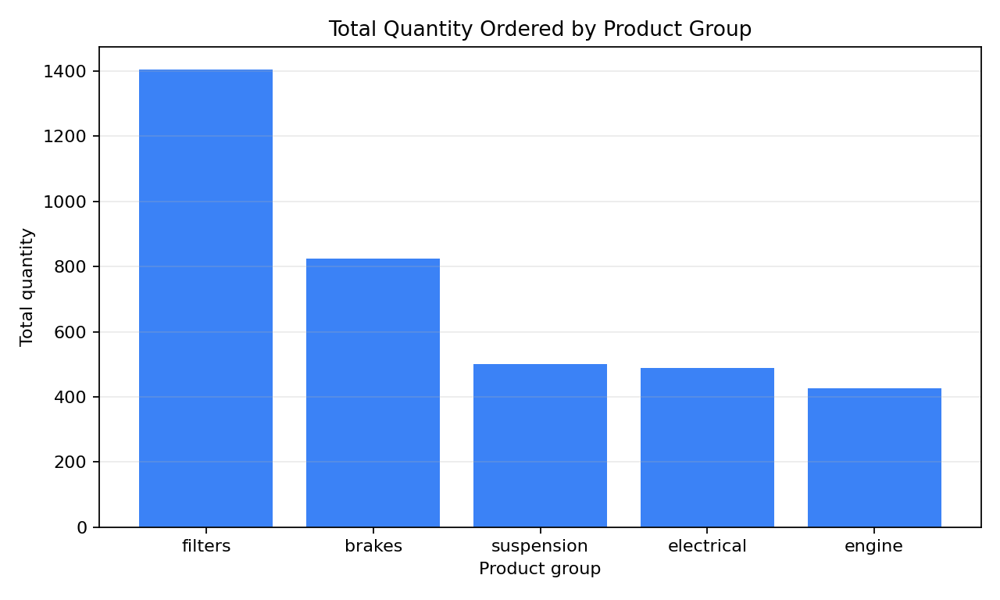
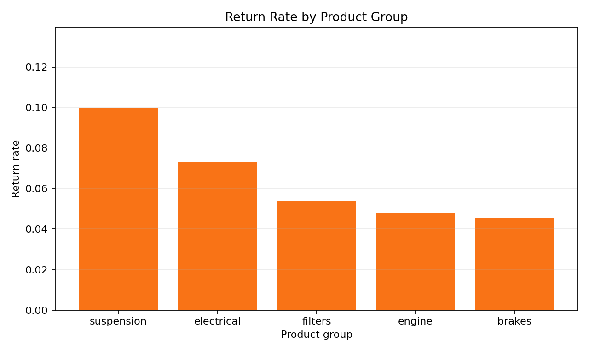

# Problem 9 — Warehouse Orders, Demand, and Returns

## Generated files

- Dataset: [`problem_09_warehouse_orders.csv`](problem_09_warehouse_orders.csv)
- Overall summary: [`warehouse_orders_overall_summary.csv`](warehouse_orders_overall_summary.csv)
- Warehouse summary: [`summary_by_warehouse.csv`](summary_by_warehouse.csv)
- Product-group summary: [`summary_by_product_group.csv`](summary_by_product_group.csv)
- Return rate by product group: [`return_rate_by_product_group.csv`](return_rate_by_product_group.csv)
- Return rate by warehouse: [`return_rate_by_warehouse.csv`](return_rate_by_warehouse.csv)
- Daily total quantity: [`daily_total_quantity.csv`](daily_total_quantity.csv)
- Plots:
  - [`total_quantity_by_product_group.png`](total_quantity_by_product_group.png)
  - [`return_rate_by_product_group.png`](return_rate_by_product_group.png)

## Description of the data

One row represents one warehouse order line. The dataset records the order identifier, date, warehouse, product group, ordered quantity, and whether the order line was returned.

The dataset contains 1200 order lines.

## Overall summary

| Order lines | Total quantity | Mean quantity per order line | Returned lines | Return rate |
| ----------: | -------------: | ---------------------------: | -------------: | ----------: |
| 1200 | 3646 | 3.0383 | 74 | 0.0617 |

The overall return rate is 0.0617, so about 6.17% of order lines were returned.

## Demand by warehouse

| Warehouse | Order lines | Total quantity | Average quantity | Returned lines | Return rate |
| :-------- | ----------: | -------------: | ---------------: | -------------: | ----------: |
| central | 336 | 1029 | 3.0625 | 17 | 0.0506 |
| south | 240 | 739 | 3.0792 | 13 | 0.0542 |
| west | 233 | 737 | 3.1631 | 17 | 0.0730 |
| north | 197 | 574 | 2.9137 | 13 | 0.0660 |
| east | 194 | 567 | 2.9227 | 14 | 0.0722 |

The central warehouse has the highest total ordered quantity, 1029 units. This is partly because it also has the largest number of order lines.

## Demand and returns by product group

| Product group | Order lines | Total quantity | Average quantity | Returned lines | Return rate |
| :------------ | ----------: | -------------: | ---------------: | -------------: | ----------: |
| filters | 353 | 1405 | 3.9802 | 19 | 0.0538 |
| brakes | 263 | 825 | 3.1369 | 12 | 0.0456 |
| suspension | 191 | 501 | 2.6230 | 19 | 0.0995 |
| electrical | 205 | 488 | 2.3805 | 15 | 0.0732 |
| engine | 188 | 427 | 2.2713 | 9 | 0.0479 |

## Plots

## Interpretation

The product groups generating the highest demand are filters and brakes. Filters have the largest total quantity, 1405 units, and the highest average quantity per order line, 3.9802.

The highest return rate is for suspension, 0.0995. This means that about 9.95% of suspension order lines were returned in this generated dataset. Electrical also has a relatively high return rate, 0.0732.

The central warehouse has the highest total quantity, but it does not have the highest return rate. The highest warehouse return rates are for west, 0.0730, and east, 0.0722.

These summaries are empirical: they describe the observed generated data. They do not give a complete theoretical probability model. A theoretical model would specify probability distributions or assumptions before observing the data. Here, we summarize what happened in this particular sample.
