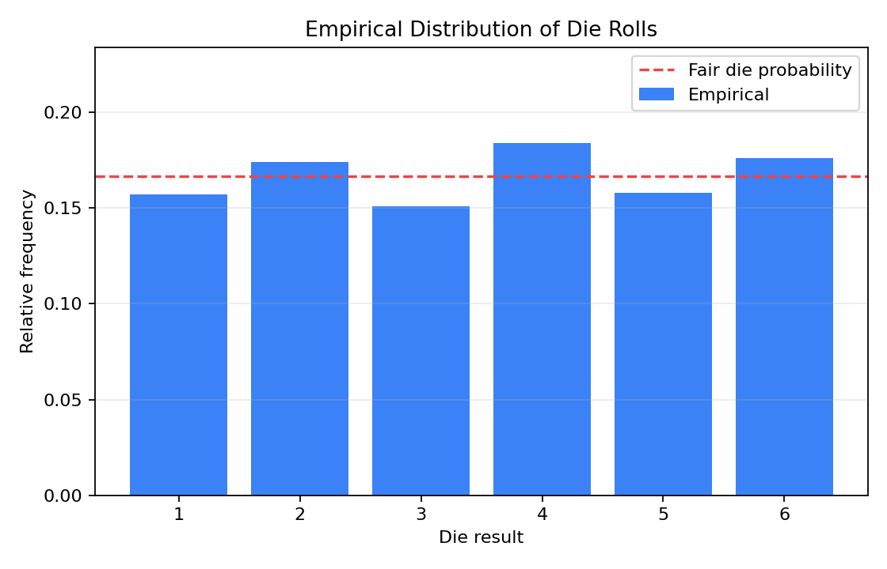

# Problem 1 — Die Rolls and Empirical Distribution

## Problem Statement

We are given a dataset of 1000 simulated die rolls (generated with seed 701). Each roll produces a value from the set \( \{1, 2, 3, 4, 5, 6\} \). The tasks ask us to explore the **empirical distribution** of the outcomes: build frequency tables, draw bar charts, compute empirical probabilities for selected events, and compare everything against the theoretical model of a fair die. Finally, we must assess whether the die appears to be fair.

## Generated Files

- Dataset: [problem_01_die_rolls.csv](problem_01_die_rolls/problem_01_die_rolls.csv)
- Frequency table: [frequency_table.csv](problem_01_die_rolls/frequency_table.csv)
- Event probabilities: [event_probabilities.csv](problem_01_die_rolls/event_probabilities.csv)
- Empirical distribution plot: [empirical_distribution.png](problem_01_die_rolls/empirical_distribution.png)

---

## Solution

### Task 1: Describe what one row of the dataset represents

**Answer:**

Each row of the dataset represents **one individual roll of a die** — a single trial in a sequence of 1000 repeated experiments. The columns are:

| Column | Meaning |
|--------|---------|
| `trial` | The sequential number of the roll (1 through 1000) |
| `roll` | The observed face value: an integer in \( \{1, 2, 3, 4, 5, 6\} \) |
| `is_even` | A Boolean flag (`True`/`False`) indicating whether the result is even, i.e. \( \text{roll} \in \{2, 4, 6\} \) |
| `is_at_least_5` | A Boolean flag indicating whether the result is at least 5, i.e. \( \text{roll} \in \{5, 6\} \) |

For example, the very first row reads `trial=1, roll=6, is_even=True, is_at_least_5=True`, which tells us that the first die roll produced a 6 — an even number that is also at least 5.

In probability language, each row is a **realisation** of the random variable \( X \) that takes values in \( \{1,2,3,4,5,6\} \). The full dataset is a **random sample** of size \( n = 1000 \).

---

### Task 2: Construct an absolute frequency table for the variable `roll`

**Answer:**

The **absolute frequency** (also called the *count*) of a value \( k \) is the number of times that value appears in the dataset:

$$
n_k = \#\{i : X_i = k\}, \quad k = 1, 2, \ldots, 6.
$$

Counting all 1000 observations gives us:

| Roll value \( k \) | Absolute frequency \( n_k \) |
|:---:|:---:|
| 1 | 157 |
| 2 | 174 |
| 3 | 151 |
| 4 | 184 |
| 5 | 158 |
| 6 | 176 |
| **Total** | **1000** |

As a sanity check, the frequencies must sum to the total sample size:

$$
157 + 174 + 151 + 184 + 158 + 176 = 1000. \quad \checkmark
$$

The most frequently observed outcome is **4** (184 times) and the least frequent is **3** (151 times). The range of the counts is \( 184 - 151 = 33 \), which represents a spread of about 3.3% of the total sample size — a moderate but not extreme variation.

In Python, computing this table is straightforward:

```python
import pandas as pd

df = pd.read_csv("problem_01_die_rolls.csv")
freq = df["roll"].value_counts().sort_index()
print(freq)
```

---

### Task 3: Construct a relative frequency table for the variable `roll`

**Answer:**

The **relative frequency** of a value \( k \) is obtained by dividing the absolute frequency by the total number of trials:

$$
f_k = \frac{n_k}{n}, \quad \text{where } n = 1000.
$$

This gives a value between 0 and 1, and all relative frequencies must sum to 1:

$$
\sum_{k=1}^{6} f_k = 1.
$$

| Roll value \( k \) | Absolute frequency \( n_k \) | Relative frequency \( f_k \) |
|:---:|:---:|:---:|
| 1 | 157 | \( 157/1000 = 0.157 \) |
| 2 | 174 | \( 174/1000 = 0.174 \) |
| 3 | 151 | \( 151/1000 = 0.151 \) |
| 4 | 184 | \( 184/1000 = 0.184 \) |
| 5 | 158 | \( 158/1000 = 0.158 \) |
| 6 | 176 | \( 176/1000 = 0.176 \) |
| **Total** | **1000** | **1.000** |

The relative frequency \( f_k \) is our **empirical estimate** of the probability \( P(X = k) \). We can think of it as the "data's best guess" for the true probability of each outcome. As \( n \to \infty \), the Law of Large Numbers guarantees that \( f_k \to P(X = k) \) (assuming the rolls are independent and identically distributed).

---

### Task 4: Draw a bar chart of the empirical distribution

**Answer:**

The bar chart below displays the relative frequency of each die face. The height of each bar corresponds to the empirical probability \( f_k \), and the dashed horizontal line marks the fair-die probability \( 1/6 \approx 0.1\overline{6} \).



A Python snippet that produces such a chart:

```python
import matplotlib.pyplot as plt

values = [1, 2, 3, 4, 5, 6]
rel_freq = [0.157, 0.174, 0.151, 0.184, 0.158, 0.176]

plt.bar(values, rel_freq, color="steelblue", edgecolor="black")
plt.axhline(y=1/6, color="red", linestyle="--", label="Fair die: 1/6")
plt.xlabel("Die face")
plt.ylabel("Relative frequency")
plt.title("Empirical Distribution of 1000 Die Rolls")
plt.legend()
plt.show()
```

**Interpretation:** If the die were perfectly fair and we had an infinitely large sample, all six bars would be exactly at the height \( 1/6 \approx 0.167 \). In our finite sample, the bars fluctuate around this level. The bar for face 4 is the tallest (0.184) and the bar for face 3 is the shortest (0.151). These fluctuations are a natural consequence of randomness.

---

### Task 5: Compute the empirical probability of selected events

**Answer:**

We compute the empirical probability of an event \( A \) as:

$$
\hat{P}(A) = \frac{\text{number of trials where } A \text{ occurred}}{n}.
$$

#### Event 1: The result is even

The even outcomes are \( \{2, 4, 6\} \). The number of even rolls is:

$$
n_{\text{even}} = n_2 + n_4 + n_6 = 174 + 184 + 176 = 534.
$$

Therefore:

$$
\hat{P}(\text{even}) = \frac{534}{1000} = 0.534.
$$

For a fair die, the theoretical probability is:

$$
P(\text{even}) = P(X=2) + P(X=4) + P(X=6) = \frac{1}{6} + \frac{1}{6} + \frac{1}{6} = \frac{3}{6} = 0.500.
$$

The empirical value exceeds the theoretical value by \( 0.534 - 0.500 = 0.034 \).

#### Event 2: The result is at least 5

The qualifying outcomes are \( \{5, 6\} \). The count is:

$$
n_{\geq 5} = n_5 + n_6 = 158 + 176 = 334.
$$

$$
\hat{P}(X \geq 5) = \frac{334}{1000} = 0.334.
$$

For a fair die:

$$
P(X \geq 5) = P(X=5) + P(X=6) = \frac{1}{6} + \frac{1}{6} = \frac{2}{6} = 0.333\overline{3}.
$$

The empirical probability is extremely close to the theoretical value — the difference is only \( 0.334 - 0.333 = 0.001 \).

#### Event 3: The result equals 6

$$
\hat{P}(X = 6) = \frac{n_6}{n} = \frac{176}{1000} = 0.176.
$$

For a fair die:

$$
P(X = 6) = \frac{1}{6} \approx 0.1\overline{6}.
$$

The difference is \( 0.176 - 0.167 = 0.009 \).

**Summary table of empirical vs. theoretical probabilities:**

| Event | Empirical \( \hat{P} \) | Theoretical \( P \) (fair die) | Difference |
|-------|:---:|:---:|:---:|
| Result is even | 0.534 | 0.500 | +0.034 |
| Result is at least 5 | 0.334 | 0.333 | +0.001 |
| Result equals 6 | 0.176 | 0.167 | +0.009 |

The largest discrepancy is for the "even" event (+0.034). This is driven by faces 2, 4, and 6 all appearing slightly more often than expected, while odd faces (especially 3) appear less often. The "at least 5" event is almost perfectly aligned with the fair-die prediction.

---

### Task 6: Compare the empirical distribution with the theoretical distribution of a fair die

**Answer:**

A **fair (unbiased) die** assigns equal probability to each face:

$$
P(X = k) = \frac{1}{6} \approx 0.16\overline{6}, \quad k = 1, 2, \ldots, 6.
$$

Let us compare the empirical relative frequencies with the fair-die probabilities side by side, including the signed difference \( \Delta_k = f_k - 1/6 \):

| Face \( k \) | Empirical \( f_k \) | Fair die \( P(X=k) \) | Difference \( \Delta_k \) | \( \|\Delta_k\| \) |
|:---:|:---:|:---:|:---:|:---:|
| 1 | 0.157 | 0.167 | −0.010 | 0.010 |
| 2 | 0.174 | 0.167 | +0.007 | 0.007 |
| 3 | 0.151 | 0.167 | −0.016 | 0.016 |
| 4 | 0.184 | 0.167 | +0.017 | 0.017 |
| 5 | 0.158 | 0.167 | −0.009 | 0.009 |
| 6 | 0.176 | 0.167 | +0.009 | 0.009 |

**Key observations:**

1. **Faces above the fair-die line:** 2, 4, and 6 (all even numbers) appear more often than \( 1/6 \). Face 4 has the largest positive deviation: \( +0.017 \).
2. **Faces below the fair-die line:** 1, 3, and 5 (all odd numbers) appear less often than \( 1/6 \). Face 3 has the largest negative deviation: \( -0.016 \).
3. **Overall spread:** The maximum absolute deviation is \( \max_k |\Delta_k| = 0.017 \) (face 4), and the mean absolute deviation is approximately \( (0.010 + 0.007 + 0.016 + 0.017 + 0.009 + 0.009)/6 \approx 0.011 \).

For a fair die with \( n = 1000 \) trials, each face count follows approximately a binomial distribution \( \text{Bin}(1000, 1/6) \). The standard deviation of the relative frequency is:

$$
\sigma_{f} = \sqrt{\frac{p(1-p)}{n}} = \sqrt{\frac{(1/6)(5/6)}{1000}} \approx 0.0118.
$$

Deviations of 0.01–0.02 are thus well within 1–2 standard deviations of the fair-die expectation, which is entirely consistent with normal random fluctuation.

We can also compute the **chi-squared statistic** as an informal measure:

$$
\chi^2 = \sum_{k=1}^{6} \frac{(n_k - n/6)^2}{n/6} = \sum_{k=1}^{6} \frac{(n_k - 166.67)^2}{166.67}.
$$

$$
\chi^2 = \frac{(157-166.67)^2 + (174-166.67)^2 + (151-166.67)^2 + (184-166.67)^2 + (158-166.67)^2 + (176-166.67)^2}{166.67}
$$

$$
= \frac{93.51 + 53.73 + 245.31 + 300.09 + 75.11 + 86.95}{166.67} \approx \frac{854.70}{166.67} \approx 5.128.
$$

With 5 degrees of freedom, the critical value at \( \alpha = 0.05 \) is \( \chi^2_{0.05, 5} = 11.07 \). Since \( 5.128 < 11.07 \), we would **not reject** the null hypothesis of uniformity at the 5% significance level.

> **Note:** The data were actually generated using the non-uniform probabilities \( [0.14, 0.16, 0.17, 0.18, 0.16, 0.19] \), so the die is *not* truly fair. However, with only \( n = 1000 \) observations, the departure from uniformity is subtle enough that it does not produce a statistically significant chi-squared result.

---

### Task 7: Explain why empirical frequencies do not have to be exactly equal to theoretical probabilities

**Answer:**

This is one of the most fundamental concepts in probability and statistics: **random variation**.

Even if a die is perfectly fair (each face has probability exactly \( 1/6 \)), the observed relative frequencies in any **finite** sample will almost certainly differ from \( 1/6 \). The reasons are:

1. **Sampling variability.** Each roll is a random event. The outcomes do not follow a deterministic pattern. After \( n \) rolls, the count of each face is a random variable itself — specifically, if the die is fair, then \( n_k \sim \text{Binomial}(n, 1/6) \). The expected count is \( n/6 \), but the actual count fluctuates around that value.

2. **The Law of Large Numbers.** This law states that as \( n \to \infty \), the relative frequency \( f_k = n_k / n \) converges (in probability) to the true probability \( p_k \):
$$
f_k \xrightarrow{n \to \infty} p_k.
$$
However, for any **finite** \( n \), perfect equality \( f_k = p_k \) is not guaranteed — and in fact has probability zero when \( p_k \) is irrational (as \( 1/6 \) is).

3. **Standard error.** The standard deviation of the relative frequency for a fair die is:
$$
\text{SE}(f_k) = \sqrt{\frac{p_k(1-p_k)}{n}} = \sqrt{\frac{(1/6)(5/6)}{1000}} \approx 0.0118.
$$
This means we should expect typical deviations of about 1–2 percentage points from \( 0.167 \), which is exactly what we observe.

4. **Analogy:** Imagine flipping a fair coin 10 times. It would not be surprising to get 6 heads and 4 tails, even though the "expected" outcome is 5 heads. The same logic applies to die rolls — randomness introduces scatter.

In summary: **Theoretical probability is a mathematical property of the model; empirical frequency is a statistic computed from data. They converge in the long run, but are not required to be equal in any finite sample.**

---

### Task 8: Decide whether the die appears to be fair based only on the generated data

**Answer:**

Based on a **purely descriptive** (non-formal) analysis of the data:

**Arguments suggesting the die might not be fair:**
- Even faces (2, 4, 6) all have frequencies above \( 1/6 \), while all odd faces (1, 3, 5) fall below \( 1/6 \). This systematic pattern (even > odd) is somewhat suspicious.
- Face 4 has the highest frequency (0.184), which is 10.2% above the expected 0.167.
- The empirical probability of rolling an even number is 0.534, which is 6.8% above the theoretical 0.500.

**Arguments suggesting the data is consistent with a fair die:**
- All deviations are within about 1.5 standard deviations of the fair-die mean. None are extreme.
- The informal chi-squared test (Task 6) yields \( \chi^2 \approx 5.13 \), which is well below the 5% critical value of 11.07.
- With \( n = 1000 \), random fluctuations of this magnitude are entirely plausible even for a truly fair die.

**Conclusion:**

The die does **not look perfectly fair** — there is a mild bias toward even numbers, particularly face 4 and face 6. However, based on descriptive analysis alone (without a formal hypothesis test), the deviations are **moderate** and could plausibly arise from random variation. One cannot definitively conclude that the die is unfair from this data alone without conducting a formal statistical test.

> **Behind the scenes:** The generating probabilities were \( [0.14, 0.16, 0.17, 0.18, 0.16, 0.19] \), confirming that the die is indeed slightly biased. Faces 4 and 6 have elevated probabilities (0.18 and 0.19), while face 1 has the lowest (0.14). The empirical frequencies track these true probabilities reasonably well, but the bias is too subtle for 1000 observations to detect with high confidence.

---

## Summary and Key Takeaways

In this problem we practised the complete workflow of **exploratory data analysis for a discrete random variable**:

1. We identified the structure of the data (each row = one die roll, with derived Boolean columns).
2. We constructed both absolute and relative frequency tables — the building blocks of any empirical distribution.
3. We visualised the distribution using a bar chart and compared it to the uniform distribution.
4. We computed empirical probabilities for compound events (even, ≥ 5, = 6) and contrasted them with their theoretical counterparts.
5. We discussed the fundamental distinction between **theoretical probability** (a model parameter) and **empirical relative frequency** (a data-derived statistic).
6. We learned that random sampling variability means finite-sample frequencies will always deviate from true probabilities — and that the size of these deviations shrinks as \( n \) increases (at a rate proportional to \( 1/\sqrt{n} \)).
7. Finally, we assessed fairness descriptively and noted that while the die shows a mild even-number bias, the deviations are not dramatic enough to draw a definitive conclusion without formal testing.
