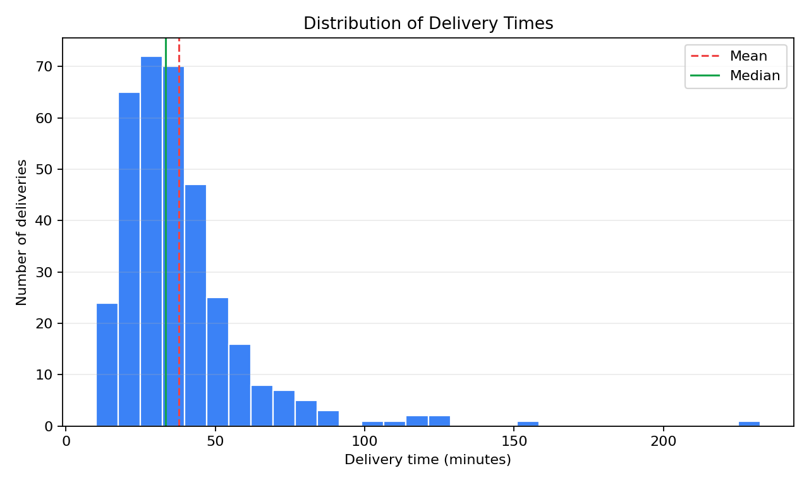
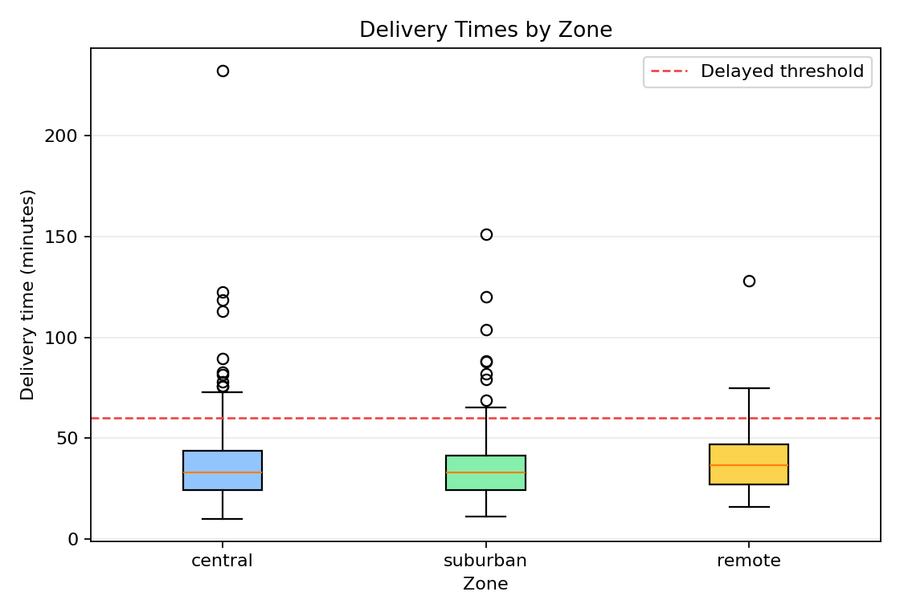

# Problem 4 — Delivery Times, Skewness, and Outliers

## Problem Statement

We have a dataset of 350 deliveries, each characterized by a delivery zone (central, suburban, or remote), a delivery time in minutes, and whether the delivery was delayed (took more than 60 minutes). The tasks involve computing descriptive statistics, identifying outliers using the 1.5 IQR rule, comparing zones, creating visualizations, and reasoning about when the median is more appropriate than the mean.

## Generated Files

| File | Description |
|------|-------------|
| [problem_04_delivery_times.csv](problem_04_delivery_times/problem_04_delivery_times.csv) | Raw dataset (350 rows) |
| [delivery_time_summary.csv](problem_04_delivery_times/delivery_time_summary.csv) | Overall summary statistics |
| [delivery_time_summary_by_zone.csv](problem_04_delivery_times/delivery_time_summary_by_zone.csv) | Summary statistics by delivery zone |
| [outliers_1_5_iqr.csv](problem_04_delivery_times/outliers_1_5_iqr.csv) | List of 20 identified outliers |
| [delivery_time_histogram.png](problem_04_delivery_times/delivery_time_histogram.png) | Histogram of all delivery times |
| [delivery_time_boxplot_by_zone.png](problem_04_delivery_times/delivery_time_boxplot_by_zone.png) | Boxplot of delivery times by zone |

---

## Solution

### Task 1: Describe what one row of the dataset represents

**Answer:**

Each row in `problem_04_delivery_times.csv` represents **one delivery**. The columns are:

| Column | Type | Meaning |
|--------|------|---------|
| `delivery_id` | string | Unique identifier (e.g., `D0001`, `D0350`) |
| `zone` | categorical | The delivery zone: `central`, `suburban`, or `remote` |
| `delivery_time_min` | float | Time from dispatch to delivery, measured in **minutes** |
| `delayed` | boolean | Whether the delivery was delayed (\(\text{delivery\_time\_min} > 60\)) |

The dataset contains **350 deliveries** spread across three zones:
- **Central:** 154 deliveries (44.0%)
- **Suburban:** 140 deliveries (40.0%)
- **Remote:** 56 deliveries (16.0%)

The **observational unit** is a single delivery event, and the **response variable** of primary interest is `delivery_time_min`.

---

### Task 2: Compute the mean and median delivery time

**Answer:**

The **sample mean** is defined as:

$$
\bar{x} = \frac{1}{n}\sum_{i=1}^{n} x_i
$$

The **median** is the value that splits the sorted observations into two equal halves. For \( n = 350 \) (even), the median is the average of the 175th and 176th sorted observations:

$$
\text{Median} = \frac{x_{(175)} + x_{(176)}}{2}
$$

```python
import pandas as pd

df = pd.read_csv("problem_04_delivery_times.csv")
mean_val = df["delivery_time_min"].mean()    # 37.730
median_val = df["delivery_time_min"].median()  # 33.300
```

**Results:**

| Statistic | Value (minutes) |
|-----------|----------------:|
| Mean | 37.730 |
| Median | 33.300 |

**Interpretation:**

The mean delivery time is **37.730 minutes**, while the median is **33.300 minutes**. The mean exceeds the median by about 4.4 minutes. This gap is a strong indication that the distribution of delivery times is **right-skewed** — a few unusually long deliveries pull the mean upward while leaving the median relatively unaffected.

In practical terms: 50% of all deliveries were completed in **33.3 minutes or less**, but the average is inflated to 37.7 minutes because of some extreme deliveries.

---

### Task 3: Explain why the mean and median are different

**Answer:**

The mean and median differ because the distribution of delivery times is **positively (right) skewed**. Let us understand this in detail:

**Symmetric vs. Skewed Distributions:**

For a perfectly symmetric distribution, the mean and median coincide. For a right-skewed distribution:

$$
\text{Mean} > \text{Median}
$$

This happens because the mean is a **weighted average** of all values — it is influenced by every observation, including extreme ones. The median, by contrast, depends only on the **rank order** of the data and is unaffected by how far the extreme values are from the center.

**What is happening in this dataset:**

Most delivery times cluster in the range of roughly 15–50 minutes. However, there is a long right tail with deliveries taking 70, 80, 100, 120, and even **232.5 minutes**. These extreme values are "outliers" relative to the bulk of the data.

Consider this thought experiment: if we replaced the single delivery of 232.5 minutes with a delivery of 50 minutes (near the bulk of the data), the mean would decrease noticeably, but the median would barely change at all.

Mathematically, the **skewness** can be estimated using the relationship:

$$
\text{Skewness indicator} = \frac{3(\bar{x} - \text{Median})}{s} \approx \frac{3(37.730 - 33.300)}{s}
$$

Since \( \bar{x} > \text{Median} \), the skewness indicator is positive, confirming right skew.

**Why does this matter?** When reporting a "typical" delivery time to customers or managers, the median of 33.3 minutes is more representative than the mean of 37.7 minutes, because the mean is inflated by rare but extreme cases.

---

### Task 4: Compute Q1, Q2, Q3, and the IQR

**Answer:**

The **quartiles** divide the sorted data into four equal parts:
- \( Q_1 \) (25th percentile): 25% of observations fall below this value
- \( Q_2 \) (50th percentile): the median
- \( Q_3 \) (75th percentile): 75% of observations fall below this value

The **Interquartile Range (IQR)** measures the spread of the middle 50% of the data:

$$
\text{IQR} = Q_3 - Q_1
$$

```python
Q1 = df["delivery_time_min"].quantile(0.25)  # 24.625
Q2 = df["delivery_time_min"].quantile(0.50)  # 33.300 (median)
Q3 = df["delivery_time_min"].quantile(0.75)  # 43.775
IQR = Q3 - Q1                                 # 19.150
```

**Results:**

| Quartile | Value (minutes) |
|----------|----------------:|
| \( Q_1 \) (25th percentile) | 24.625 |
| \( Q_2 \) (median, 50th percentile) | 33.300 |
| \( Q_3 \) (75th percentile) | 43.775 |
| IQR | 19.150 |

**Interpretation:**

- The **middle 50%** of all delivery times fall between 24.625 and 43.775 minutes — a span of 19.15 minutes.
- \( Q_1 = 24.625 \): One quarter of deliveries took less than ~25 minutes.
- \( Q_2 = 33.300 \): Half of deliveries took less than ~33 minutes.
- \( Q_3 = 43.775 \): Three quarters of deliveries took less than ~44 minutes.

Notice the asymmetry in the quartile spacing:
- Distance from \( Q_1 \) to \( Q_2 \): \( 33.300 - 24.625 = 8.675 \) minutes
- Distance from \( Q_2 \) to \( Q_3 \): \( 43.775 - 33.300 = 10.475 \) minutes

The upper half of the IQR is wider than the lower half, which is another sign of **right skewness** even within the central portion of the data.

---

### Task 5: Use the 1.5 IQR rule to identify possible outliers

**Answer:**

The **1.5 IQR rule** (also known as **Tukey's fence**) is a standard method for identifying potential outliers. The rule defines two "fences":

$$
\text{Lower fence} = Q_1 - 1.5 \times \text{IQR}
$$

$$
\text{Upper fence} = Q_3 + 1.5 \times \text{IQR}
$$

Any observation that falls **below the lower fence** or **above the upper fence** is flagged as a possible outlier.

**Computation:**

$$
\text{Lower fence} = 24.625 - 1.5 \times 19.150 = 24.625 - 28.725 = -4.100
$$

$$
\text{Upper fence} = 43.775 + 1.5 \times 19.150 = 43.775 + 28.725 = 72.500
$$

```python
lower_fence = Q1 - 1.5 * IQR  # -4.100
upper_fence = Q3 + 1.5 * IQR  #  72.500
outliers = df[(df["delivery_time_min"] < lower_fence) |
              (df["delivery_time_min"] > upper_fence)]
```

**Key observations:**

- The lower fence is **−4.100 minutes**. Since delivery times cannot be negative, no observations can fall below this fence. Therefore, **no lower outliers** exist.
- The upper fence is **72.500 minutes**. Any delivery taking more than 72.5 minutes is flagged as a possible outlier.

**There are 20 outliers** (all above the upper fence):

| Delivery ID | Zone | Delivery Time (min) |
|:-----------:|:----:|--------------------:|
| D0004 | central | 81.4 |
| D0008 | central | 77.9 |
| D0061 | central | 118.6 |
| D0079 | central | 112.8 |
| D0113 | suburban | 88.1 |
| D0123 | central | 82.8 |
| D0126 | suburban | 81.9 |
| D0144 | central | 122.6 |
| D0146 | remote | 74.9 |
| D0148 | suburban | 120.2 |
| D0173 | central | 76.0 |
| D0187 | suburban | 151.0 |
| D0189 | central | 72.6 |
| D0191 | central | 75.5 |
| D0203 | central | 232.5 |
| D0206 | central | 89.6 |
| D0239 | remote | 128.1 |
| D0277 | suburban | 79.3 |
| D0284 | suburban | 88.3 |
| D0308 | suburban | 103.8 |

The outlier proportion is:

$$
\frac{20}{350} \approx 0.057 \quad (5.7\%)
$$

**Observations about the outliers:**

- The most extreme outlier is **D0203** in the central zone with a delivery time of **232.5 minutes** — nearly 4 hours. This is more than 3 times the upper fence.
- By zone: 10 outliers are in the central zone, 6 in suburban, and 2 in remote. The central zone, despite presumably being closer, has the most extreme delivery times — likely due to traffic, parking difficulty, or other urban complications.
- All 20 outliers are (unsurprisingly) also flagged as `delayed = True`.

---

### Task 6: Compute the proportion of delayed deliveries

**Answer:**

A delivery is classified as **delayed** if its delivery time exceeds 60 minutes. The proportion of delayed deliveries is:

$$
\hat{p}_{\text{delayed}} = \frac{\text{Number of delayed deliveries}}{n} = \frac{35}{350} = 0.100
$$

```python
delayed_count = df["delayed"].sum()       # 35
delayed_prop = delayed_count / len(df)    # 0.100
```

**Result:** The proportion of delayed deliveries is **0.100 (10.0%)**. That is, exactly **35 out of 350** deliveries took more than 60 minutes.

**Relationship between delayed and outlier:**

It is worth noting that the "delayed" threshold (60 minutes) and the "outlier" threshold (72.5 minutes) are different:

$$
60 < 72.5
$$

This means every outlier is delayed, but not every delayed delivery is an outlier. There are \( 35 - 20 = 15 \) deliveries that took between 60 and 72.5 minutes — these are delayed but **not** classified as statistical outliers by the 1.5 IQR rule.

---

### Task 7: Compare delivery times between zones

**Answer:**

We compute descriptive statistics for each of the three delivery zones.

```python
zone_stats = df.groupby("zone")["delivery_time_min"].agg(
    ["count", "mean", "median", "min", "max", "std"]
)
delayed_by_zone = df.groupby("zone")["delayed"].mean()
```

**Results:**

| Zone | Count | Mean | Median | Min | Max | Std Dev | Delayed % |
|:-----|------:|-----:|-------:|----:|----:|--------:|----------:|
| Central | 154 | 38.686 | 33.000 | 10.000 | 232.500 | 25.337 | 11.7% |
| Remote | 56 | 39.168 | 36.450 | 16.000 | 128.100 | 18.569 | 8.9% |
| Suburban | 140 | 36.103 | 33.050 | 11.300 | 151.000 | 19.855 | 8.6% |

**Detailed analysis:**

1. **Mean delivery time:** The remote zone has the highest mean (39.168 min), followed by central (38.686 min) and suburban (36.103 min). However, the differences are relatively small (only ~3 minutes between the highest and lowest).

2. **Median delivery time:** The remote zone has the highest median (36.450 min), while central and suburban are nearly identical (33.000 and 33.050 min respectively). This tells us:
   - A "typical" remote delivery takes about 3.5 minutes longer than a typical central or suburban delivery.
   - The gap between mean and median is largest for the central zone:

$$
\text{Central gap:} \quad 38.686 - 33.000 = 5.686 \text{ min}
$$

$$
\text{Remote gap:} \quad 39.168 - 36.450 = 2.718 \text{ min}
$$

$$
\text{Suburban gap:} \quad 36.103 - 33.050 = 3.053 \text{ min}
$$

   The large central gap indicates that the central zone has the **most skewed** distribution.

3. **Standard deviation:** The central zone has by far the largest standard deviation (**25.337 min**), compared to suburban (19.855) and remote (18.569). This is driven by the extreme outlier at 232.5 minutes and several other very long deliveries.

4. **Extremes:** The central zone has both the overall minimum (10.0 min) and the overall maximum (232.5 min) — a range of 222.5 minutes! This enormous range suggests highly variable conditions in the central zone.

5. **Delayed proportion:** The central zone has the highest proportion of delayed deliveries (**11.7%**), despite being presumably the closest zone. The suburban (8.6%) and remote (8.9%) zones have similar, lower delayed rates.

**Summary by zone:**

| Aspect | Best zone | Worst zone |
|--------|-----------|------------|
| Lowest mean | Suburban (36.1) | Remote (39.2) |
| Lowest median | Central (33.0) | Remote (36.5) |
| Most consistent | Remote (std 18.6) | Central (std 25.3) |
| Fewest delays | Suburban (8.6%) | Central (11.7%) |

The central zone is a paradox: it has some of the fastest deliveries but also the most extreme delays, making it the most variable and the zone with the most delays.

---

### Task 8: Draw a histogram of `delivery_time_min`

**Answer:**

The histogram below shows the frequency distribution of all 350 delivery times.



```python
import matplotlib.pyplot as plt

fig, ax = plt.subplots(figsize=(10, 6))
ax.hist(df["delivery_time_min"], bins=30, edgecolor="black", alpha=0.7)
ax.set_xlabel("Delivery Time (minutes)")
ax.set_ylabel("Frequency")
ax.set_title("Distribution of Delivery Times")
ax.axvline(x=37.73, color="red", linestyle="--", label=f"Mean = 37.73")
ax.axvline(x=33.30, color="blue", linestyle="--", label=f"Median = 33.30")
ax.legend()
plt.tight_layout()
plt.savefig("delivery_time_histogram.png", dpi=150)
```

**What the histogram reveals:**

1. **Right skewness:** The bulk of the data is concentrated on the left side (roughly 10–50 minutes), with a long tail extending to the right. This confirms the positive skew we detected numerically.

2. **Mode:** The peak of the histogram (the tallest bin) appears to be around 20–35 minutes, suggesting this is the most common delivery time range.

3. **Right tail:** There are scattered observations at 70, 80, 100, 120, and even 232 minutes. These rare but extreme values form the right tail and are responsible for pulling the mean above the median.

4. **Mean vs. Median position:** If the mean and median were plotted on the histogram, the mean (37.73) would be to the right of the median (33.30), reflecting the rightward pull from outliers.

5. **Approximate normality?** The distribution is **not normal** — it is clearly right-skewed with heavy right tail. This is common for time-to-event data (delivery times, waiting times, service times), which are bounded below by zero and can have occasional very large values.

---

### Task 9: Draw a boxplot of delivery times by zone

**Answer:**

The boxplots below compare the distribution of delivery times across the three zones.



```python
fig, ax = plt.subplots(figsize=(10, 6))
df.boxplot(column="delivery_time_min", by="zone", ax=ax)
ax.set_xlabel("Zone")
ax.set_ylabel("Delivery Time (minutes)")
ax.set_title("Delivery Times by Zone")
plt.suptitle("")
plt.tight_layout()
plt.savefig("delivery_time_boxplot_by_zone.png", dpi=150)
```

**Reading the boxplots:**

Recall the components of a boxplot:
- **Box:** spans from \( Q_1 \) to \( Q_3 \), containing the middle 50% of data
- **Horizontal line in box:** the median (\( Q_2 \))
- **Whiskers:** extend to the furthest non-outlier data points (within \( 1.5 \times \text{IQR} \) of the box)
- **Dots/circles beyond whiskers:** potential outliers

**Observations from the boxplots:**

1. **Medians are similar:** All three zones have medians in the 33–36 minute range. The remote zone's median is slightly higher.

2. **Central zone:** Has the largest spread — the box is tall, and there are several outliers extending far above the upper whisker, including the extreme outlier at 232.5 minutes. This zone's variability dominates the plot.

3. **Suburban zone:** Has moderate spread with a few outliers (the longest being 151.0 minutes).

4. **Remote zone:** Has the smallest box (fewest observations, \(n = 56\)), with only two outliers (74.9 and 128.1 minutes).

5. **All zones are right-skewed:** In each boxplot, the distance from the median to \( Q_3 \) is larger than the distance from \( Q_1 \) to the median, and the upper whisker extends further than the lower whisker.

---

### Task 10: Explain why the median may be more informative than the mean

**Answer:**

In this dataset, the **median is more informative than the mean** for describing a "typical" delivery time. Here is a thorough explanation of why:

**1. Robustness to outliers:**

The mean is a **non-robust** statistic — it is heavily influenced by extreme values. Consider the most extreme delivery in our dataset: D0203 with a delivery time of 232.5 minutes. If we excluded just this one observation, the mean would drop noticeably:

$$
\bar{x}_{\text{without D0203}} \approx \frac{n \cdot \bar{x} - 232.5}{n - 1} = \frac{350 \times 37.730 - 232.5}{349} \approx \frac{12,973.0}{349} \approx 37.17
$$

That single observation raised the mean by about 0.56 minutes. Now imagine removing all 20 outliers — the mean would decrease substantially, while the median would barely change.

The median depends only on the **ranks** of the data (the 175th and 176th values). Changing an outlier from 232.5 to 2325 would not affect the median at all — but it would dramatically increase the mean.

**2. Right-skewed distributions:**

Delivery time data is inherently right-skewed because:
- There is a natural lower bound (delivery time ≥ 0).
- There is no strict upper bound — unusual circumstances (traffic jams, wrong addresses, vehicle breakdowns) can cause very long delivery times.
- Most deliveries complete within a "normal" range, but a few take much longer.

For right-skewed distributions:

$$
\text{Mode} < \text{Median} < \text{Mean}
$$

The mean is pulled toward the right tail and **overestimates** what a "typical" delivery looks like. In our data:

$$
\text{Median} = 33.300 < \text{Mean} = 37.730
$$

If a logistics manager asks "how long does a typical delivery take?", the answer **33.3 minutes** (median) is more representative than **37.7 minutes** (mean), because more than 50% of deliveries complete in under 33.3 minutes.

**3. Practical decision-making:**

| Scenario | Better statistic |
|----------|-----------------|
| Setting customer expectations for "typical" delivery time | Median |
| Estimating total delivery costs over many deliveries | Mean |
| Identifying whether the process is improving over time | Median (less affected by occasional bad days) |
| Planning capacity to handle total workload | Mean |

For most **customer-facing** communications, the median is preferred because it answers the question: "What can most customers expect?"

**4. The mathematical reason — breakdown point:**

The **breakdown point** of a statistic measures the proportion of observations that can be arbitrarily corrupted before the statistic becomes meaningless.

- The mean has a breakdown point of **0%** — even a single extreme value can make the mean arbitrarily large.
- The median has a breakdown point of **50%** — up to half the data can be corrupted before the median breaks down.

$$
\text{Breakdown point of mean} = \frac{1}{n} \to 0 \quad \text{as } n \to \infty
$$

$$
\text{Breakdown point of median} = \frac{1}{2} = 50\%
$$

This makes the median a **much more robust** measure of central tendency for data with potential outliers, as in our delivery times dataset.

**Conclusion:**

In this dataset with 20 outliers (5.7% of observations), a clear right skew, and a mean-median gap of 4.43 minutes, the **median of 33.3 minutes** provides a more honest and useful description of a typical delivery time than the mean of 37.7 minutes. The mean remains useful for aggregate calculations (e.g., total time across all deliveries) but should not be used as the representative value for a single delivery.

---

## Summary and Key Takeaways

This problem is a case study in **skewness and its consequences for descriptive statistics**. The delivery time data is clearly right-skewed, with a bulk of observations in the 15–50 minute range and a long right tail extending to 232.5 minutes. This skewness causes the mean (37.73 min) to exceed the median (33.30 min) by about 4.4 minutes.

Key concepts reinforced:
- **Quartiles and IQR**: The IQR of 19.15 minutes captures the spread of the central 50% of data, providing a robust alternative to the standard deviation.
- **1.5 IQR rule**: Tukey's fences at \(-4.1\) and \(72.5\) identified 20 outliers — all on the upper end, confirming the right-skewed nature of the data.
- **Mean vs. Median**: For skewed distributions with outliers, the median is more representative of a "typical" observation. The mean is useful for aggregate totals but can be misleading for characterizing individual cases.
- **Zone comparison**: Despite similar medians, the zones differ substantially in variability. The central zone is a paradox — it has some of the fastest and some of the slowest deliveries, resulting in the highest standard deviation and the most delays.
- **Robustness**: The concept of breakdown point explains mathematically why the median is preferred for contaminated or skewed data.

When analyzing real-world data, always check for skewness and outliers before deciding which summary statistics to report. Visualizations (histograms and boxplots) are indispensable for understanding the shape of the distribution.
