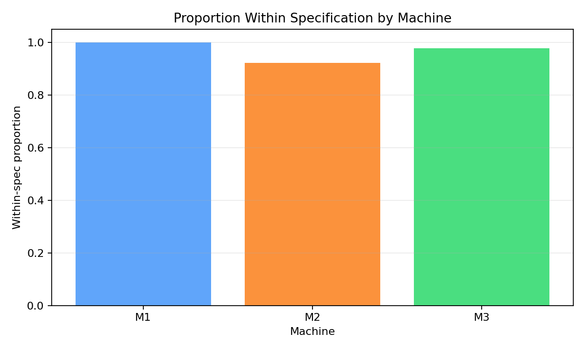
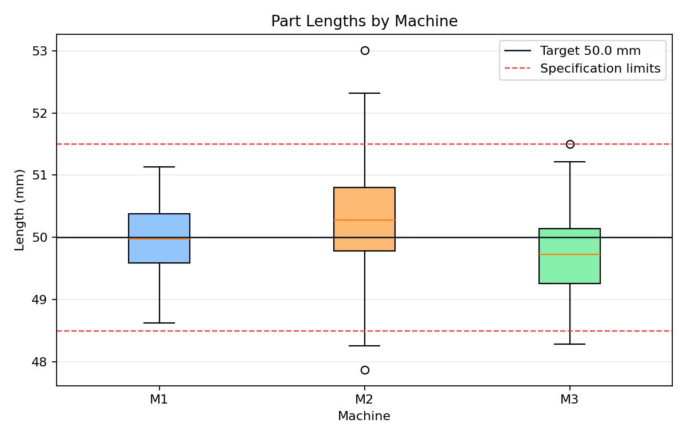

# Problem 6 — Factory Measurements and Specification Limits

## Problem Statement

A factory produces parts with a target length of **50 mm**. Three machines (M1, M2, M3) each produced 180 parts, giving a total dataset of 540 parts. Each part has been measured and classified as within the specification interval **[48.5 mm, 51.5 mm]** or out of specification. Our goal is to compute descriptive statistics overall and by machine, compare machines, draw boxplots, identify which machine is best centered and which is most variable, and explain why high variability is dangerous even when the mean is good.

## Generated Files

- Dataset: [problem_06_factory_measurements.csv](problem_06_factory_measurements/problem_06_factory_measurements.csv)
- Overall summary: [length_summary_overall.csv](problem_06_factory_measurements/length_summary_overall.csv)
- Machine summaries: [length_summary_by_machine.csv](problem_06_factory_measurements/length_summary_by_machine.csv)
- Within-spec counts: [within_spec_counts_by_machine.csv](problem_06_factory_measurements/within_spec_counts_by_machine.csv)
- Boxplot: [length_boxplots_by_machine.png](problem_06_factory_measurements/length_boxplots_by_machine.png)
- Within-spec plot: [within_spec_proportion_by_machine.png](problem_06_factory_measurements/within_spec_proportion_by_machine.png)

---

## Solution

### Task 1: Describe what one row of the dataset represents

**Answer:**

Each row in the dataset represents **one manufactured part**. The columns are:

| Column | Description | Type |
|:-------|:------------|:-----|
| `part_id` | Unique part identifier (e.g., P0001) | Categorical (ID) |
| `machine` | Machine that produced the part | Categorical: M1, M2, M3 |
| `length_mm` | Measured length in millimeters | Continuous (numeric) |
| `deviation_from_target` | \( \text{length\_mm} - 50 \) | Continuous (numeric) |
| `within_spec` | Whether \( 48.5 \leq \text{length\_mm} \leq 51.5 \) | Boolean: True / False |

For example, the first data row reads:

> **P0001**, machine **M1**, length **50.122 mm**, deviation **+0.122 mm**, **within spec = True**.

This part is 0.122 mm longer than the target of 50 mm but still well within the specification limits [48.5, 51.5].

The dataset contains a total of \( n = 540 \) parts: **180 from each of the three machines** (a balanced design).

---

### Task 2: Compute descriptive statistics for length_mm (overall)

**Answer:**

We compute the standard descriptive statistics for the entire collection of 540 parts. Let \( x_1, x_2, \ldots, x_n \) denote the measured lengths with \( n = 540 \).

**Sample mean:**

$$
\bar{x} = \frac{1}{n} \sum_{i=1}^{n} x_i = 49.9998 \text{ mm}
$$

**Sample median:**

$$
\tilde{x} = 49.9625 \text{ mm}
$$

**Minimum and Maximum:**

$$
x_{\min} = 47.873 \text{ mm}, \quad x_{\max} = 53.010 \text{ mm}
$$

**Range:**

$$
R = x_{\max} - x_{\min} = 53.010 - 47.873 = 5.137 \text{ mm}
$$

**Sample variance:**

$$
s^2 = \frac{1}{n-1} \sum_{i=1}^{n} (x_i - \bar{x})^2 = 0.4872 \text{ mm}^2
$$

**Sample standard deviation:**

$$
s = \sqrt{s^2} = \sqrt{0.4872} = 0.6980 \text{ mm}
$$

**Mean absolute deviation from target (50 mm):**

$$
\text{MAD}_{\text{target}} = \frac{1}{n} \sum_{i=1}^{n} |x_i - 50| = 0.5446 \text{ mm}
$$

**Within-specification proportion:**

$$
\hat{p}_{\text{spec}} = \frac{522}{540} \approx 0.9667
$$

```python
import pandas as pd
df = pd.read_csv("problem_06_factory_measurements.csv")
stats = {
    'count': len(df),
    'mean': df['length_mm'].mean(),
    'median': df['length_mm'].median(),
    'min': df['length_mm'].min(),
    'max': df['length_mm'].max(),
    'var': df['length_mm'].var(),
    'std': df['length_mm'].std(),
    'MAD_target': df['deviation_from_target'].abs().mean(),
    'within_spec': df['within_spec'].mean()
}
```

**Summary table:**

| Statistic | Value |
|:----------|------:|
| Count | 540 |
| Mean | 49.9998 mm |
| Median | 49.9625 mm |
| Minimum | 47.873 mm |
| Maximum | 53.010 mm |
| Variance | 0.4872 mm² |
| Std. Deviation | 0.6980 mm |
| Mean Abs. Deviation from Target | 0.5446 mm |
| Within-Spec Proportion | 96.67% |

**Interpretation:** The overall mean is almost exactly at the 50 mm target — only 0.0002 mm off. The median (49.9625 mm) is also very close, indicating the distribution is nearly symmetric around the target. A standard deviation of 0.698 mm means that roughly 68% of parts fall within \( 50 \pm 0.698 \) mm (assuming approximate normality). The within-spec rate of 96.67% means 18 out of 540 parts fell outside [48.5, 51.5]. However, as we will see, these overall statistics mask important differences between machines.

---

### Task 3: Compute descriptive statistics separately for each machine

**Answer:**

We now group by machine and compute the same statistics. Each machine produced \( n_m = 180 \) parts.

| Statistic | M1 | M2 | M3 |
|:----------|---:|---:|---:|
| Part Count | 180 | 180 | 180 |
| Mean (mm) | 49.9813 | 50.3074 | 49.7106 |
| Median (mm) | 49.972 | 50.2755 | 49.731 |
| Min (mm) | 48.625 | 47.873 | 48.288 |
| Max (mm) | 51.136 | 53.010 | 51.498 |
| Variance (mm²) | 0.2854 | 0.6256 | 0.3764 |
| Std. Deviation (mm) | 0.5343 | 0.7910 | 0.6135 |
| Mean Deviation from Target (mm) | −0.0187 | +0.3074 | −0.2894 |
| Mean Abs. Dev. from Target (mm) | 0.4399 | 0.6513 | 0.5426 |

```python
by_machine = df.groupby('machine').agg(
    count=('length_mm', 'count'),
    mean=('length_mm', 'mean'),
    median=('length_mm', 'median'),
    std=('length_mm', 'std'),
    var=('length_mm', 'var'),
    min=('length_mm', 'min'),
    max=('length_mm', 'max'),
    mean_dev=('deviation_from_target', 'mean'),
    mean_abs_dev=('deviation_from_target', lambda x: x.abs().mean())
)
```

**Key observations:**

- **M1** has a mean of 49.9813 mm — essentially right on target (deviation of only −0.0187 mm). It also has the **smallest standard deviation** (0.5343 mm) and the narrowest range (48.625 to 51.136, a span of 2.511 mm).

- **M2** has a mean of 50.3074 mm — shifted **above** the target by 0.3074 mm. It has the **largest standard deviation** (0.7910 mm) and the widest range (47.873 to 53.010, a span of 5.137 mm). This machine is both biased and imprecise.

- **M3** has a mean of 49.7106 mm — shifted **below** the target by 0.2894 mm. Its variability (std = 0.6135 mm) is moderate, falling between M1 and M2.

---

### Task 4: Compute the proportion of parts within specification (overall)

**Answer:**

A part is **within specification** if its length \( x \) satisfies:

$$
48.5 \leq x \leq 51.5
$$

Out of 540 total parts, **522 are within specification** and **18 are out of specification**.

$$
\hat{p}_{\text{spec}} = \frac{522}{540} = \frac{29}{30} \approx 0.9667
$$

In percentage terms, **96.67%** of all parts meet the specification.

The 18 out-of-spec parts represent a **defect rate** of:

$$
\hat{p}_{\text{defect}} = 1 - 0.9667 = 0.0333 \approx 3.33\%
$$

In quality-engineering terms, this corresponds to roughly 33,300 defects per million opportunities (DPMO). For reference, Six Sigma quality targets a DPMO of 3.4 (99.99966% yield), so this process is far from that standard.

```python
within_spec_count = df['within_spec'].sum()
total = len(df)
proportion = within_spec_count / total
print(f"Within spec: {within_spec_count}/{total} = {proportion:.4f}")
# Within spec: 522/540 = 0.9667
```

---

### Task 5: Compute the proportion within spec for each machine

**Answer:**

We now compute \( \hat{p}_{\text{spec}} \) separately for each machine:

| Machine | Within Spec | Out of Spec | Total | Within-Spec Proportion |
|:--------|------------:|------------:|------:|-----------------------:|
| M1      | 180         | 0           | 180   | \( 180/180 = 1.000 \) |
| M2      | 166         | 14          | 180   | \( 166/180 \approx 0.922 \) |
| M3      | 176         | 4           | 180   | \( 176/180 \approx 0.978 \) |



**Interpretation:**

- **M1** achieves a perfect **100%** within-spec rate. Every single one of its 180 parts met the specification. This is consistent with M1 having both a centered mean and a low standard deviation.

- **M3** has a very high rate of **97.8%** — only 4 parts out of 180 fell outside the spec. Despite being shifted below target, M3's moderate variability keeps most parts within bounds.

- **M2** has the lowest rate at **92.2%** — 14 parts out of 180 were out of spec. This is consistent with M2 being both biased (shifted above target) and highly variable. All 18 out-of-spec parts in the entire dataset come from either M2 (14) or M3 (4); M1 contributed zero defects.

---

### Task 6: Compare machines using mean, std dev, and proportion within spec

**Answer:**

Let us consolidate the three key metrics side by side:

| Machine | Mean (mm) | Deviation from Target (mm) | Std. Dev. (mm) | Within-Spec (%) |
|:--------|----------:|---------------------------:|---------------:|-----------------:|
| M1      | 49.9813   | −0.0187                    | 0.5343         | 100.0%           |
| M2      | 50.3074   | +0.3074                    | 0.7910         | 92.2%            |
| M3      | 49.7106   | −0.2894                    | 0.6135         | 97.8%            |

**Ranking by each criterion:**

| Criterion | Best | Middle | Worst |
|:----------|:-----|:-------|:------|
| Closest to target (smallest \|\text{deviation}\|) | M1 (0.019) | M3 (0.289) | M2 (0.307) |
| Lowest variability (smallest std) | M1 (0.534) | M3 (0.614) | M2 (0.791) |
| Highest within-spec proportion | M1 (100%) | M3 (97.8%) | M2 (92.2%) |

**M1 wins on all three criteria.** It is the most accurate (centered on target), the most precise (lowest variability), and as a consequence, it achieves a perfect within-spec rate. M3 is the runner-up: it has a moderate bias and moderate variability, but still achieves a strong 97.8% yield. M2 is the worst on all counts — it is biased above target, has the highest variability, and consequently has the lowest yield.

To understand why variability matters, consider the **3-sigma limits** for each machine. If we assume approximate normality, about 99.7% of parts would fall within \( \bar{x} \pm 3s \):

| Machine | \( \bar{x} - 3s \) | \( \bar{x} + 3s \) | Spec Lower (48.5) | Spec Upper (51.5) |
|:--------|--------------------:|--------------------:|-------------------:|-------------------:|
| M1      | 48.378              | 51.584              | Barely exceeds     | Barely exceeds     |
| M2      | 47.934              | 52.680              | Well outside       | Well outside       |
| M3      | 47.870              | 51.551              | Well outside       | Barely exceeds     |

For M2, the 3-sigma range extends far beyond both specification limits, explaining its high defect rate. For M1, the 3-sigma range barely exceeds the spec limits, explaining why we observed zero defects in 180 parts.

---

### Task 7: Draw boxplots of length_mm by machine

**Answer:**

The boxplots below show the distribution of part lengths for each machine. The horizontal dashed lines (if present) represent the specification limits at 48.5 mm and 51.5 mm, and the target of 50 mm.



```python
import matplotlib.pyplot as plt
fig, ax = plt.subplots(figsize=(8, 5))
df.boxplot(column='length_mm', by='machine', ax=ax)
ax.axhline(y=50.0, color='green', linestyle='--', label='Target (50 mm)')
ax.axhline(y=48.5, color='red', linestyle='--', label='Lower spec (48.5)')
ax.axhline(y=51.5, color='red', linestyle='--', label='Upper spec (51.5)')
ax.legend()
plt.savefig('length_boxplots_by_machine.png')
```

**How to read a boxplot:**

- The **box** spans the interquartile range (IQR), from the 25th percentile (\( Q_1 \)) to the 75th percentile (\( Q_3 \)).
- The **line inside the box** is the median.
- The **whiskers** extend to the most extreme data points within \( 1.5 \times \text{IQR} \) of the box edges.
- **Points** beyond the whiskers are outliers.

**Observations from the boxplots:**

1. **M1's box** is centered near 50 mm and is the narrowest (smallest IQR). The whiskers are relatively short, and no data points exceed the spec limits. This visually confirms M1 as the best machine.

2. **M2's box** is shifted upward (median ≈ 50.28 mm) and is the widest. Its whiskers extend far, and some outlier points reach above 51.5 mm and one even reaches 53.01 mm. There are also lower outliers near 47.87 mm. This machine is both biased and noisy.

3. **M3's box** is shifted downward (median ≈ 49.73 mm). Its spread is moderate — wider than M1 but narrower than M2. A few lower outliers dip below 48.5 mm.

---

### Task 8: Which machine seems most centered around the target?

**Answer:**

**Machine M1** is clearly the most centered around the target of 50 mm.

The evidence:

- M1's mean is **49.9813 mm**, only \( |49.9813 - 50| = 0.0187 \) mm from the target.
- M1's median is **49.972 mm**, also extremely close.
- M1's mean deviation from target is **−0.0187 mm** — essentially zero bias.

For comparison:

$$
|\text{bias}_{M1}| = 0.0187 \ll |\text{bias}_{M3}| = 0.2894 < |\text{bias}_{M2}| = 0.3074
$$

M1's bias is roughly **15 times smaller** than M2's and M3's. In manufacturing terminology, M1 has the best **accuracy** — its measurements are centered on the true target value.

Both M2 and M3 exhibit systematic bias:
- M2 produces parts that are, on average, **0.307 mm too long**.
- M3 produces parts that are, on average, **0.289 mm too short**.

These biases could potentially be corrected through machine recalibration, but M1 requires no such adjustment.

---

### Task 9: Which machine seems most variable?

**Answer:**

**Machine M2** is the most variable by every measure of dispersion.

| Variability Measure | M1 | M2 | M3 |
|:---------------------|---:|---:|---:|
| Standard deviation (mm) | 0.5343 | **0.7910** | 0.6135 |
| Variance (mm²) | 0.2854 | **0.6256** | 0.3764 |
| Range (mm) | 2.511 | **5.137** | 3.210 |
| Mean abs. deviation from target (mm) | 0.4399 | **0.6513** | 0.5426 |

M2's standard deviation of **0.7910 mm** is:
- **48% larger** than M1's (0.534 mm): ratio \( 0.791 / 0.534 \approx 1.48 \)
- **29% larger** than M3's (0.614 mm): ratio \( 0.791 / 0.614 \approx 1.29 \)

In terms of variance, M2's is **2.19 times** that of M1:

$$
\frac{s^2_{M2}}{s^2_{M1}} = \frac{0.6256}{0.2854} \approx 2.19
$$

M2's range of 5.137 mm (from 47.873 to 53.010) is more than twice M1's range of 2.511 mm. This enormous spread means M2 produces everything from parts that are more than 2 mm too short to parts that are 3 mm too long.

In manufacturing terminology, M2 has the worst **precision** — its individual measurements are widely scattered, even if (hypothetically) the mean could be corrected by recalibration.

---

### Task 10: Explain why a good mean but high variability can be problematic

**Answer:**

This is one of the most important lessons in quality engineering and statistical process control. A machine can have a **perfect mean** (exactly on target) yet still produce a large number of **defective parts** if its variability is high.

**The mathematical explanation:**

Suppose a machine's output follows a normal distribution \( X \sim \mathcal{N}(\mu, \sigma^2) \) with \( \mu = 50 \) mm (perfect centering). The proportion of parts within specification [48.5, 51.5] is:

$$
P(48.5 \leq X \leq 51.5) = \Phi\!\left(\frac{51.5 - 50}{\sigma}\right) - \Phi\!\left(\frac{48.5 - 50}{\sigma}\right) = 2\,\Phi\!\left(\frac{1.5}{\sigma}\right) - 1
$$

where \( \Phi \) is the standard normal CDF. The result depends critically on \( \sigma \):

| \( \sigma \) (mm) | \( 1.5/\sigma \) | \( P(\text{within spec}) \) | Defect Rate |
|-------------------:|-----------------:|----------------------------:|------------:|
| 0.25               | 6.0              | 99.9999998%                 | 0.002 ppm   |
| 0.50               | 3.0              | 99.73%                      | 0.27%       |
| 0.75               | 2.0              | 95.45%                      | 4.55%       |
| 1.00               | 1.5              | 86.64%                      | 13.36%      |
| 1.50               | 1.0              | 68.27%                      | 31.73%      |

Even with a *perfect* mean of 50 mm, a standard deviation of 1.5 mm would result in **nearly one-third** of all parts being out of specification!

**Visual intuition:**

Imagine the normal bell curve centered at 50 mm. The specification limits at 48.5 and 51.5 are vertical walls. As \( \sigma \) increases, the bell curve gets wider and flatter — more of its area spills beyond the walls:

$$
\sigma \uparrow \quad \Longrightarrow \quad \text{tails extend beyond spec limits} \quad \Longrightarrow \quad \text{defect rate} \uparrow
$$

**Concrete example from our data:**

M2 has a mean of 50.3074 mm — not terribly far from 50 mm. But its standard deviation of 0.7910 mm means that parts range from 47.87 mm to 53.01 mm. The combination of slight bias *and* high variability produces a within-spec rate of only 92.2%, the worst of all three machines. If M2's variability were as low as M1's (0.534 mm), its defect rate would drop dramatically even without fixing the bias.

**The process capability index \( C_{pk} \):**

This concept is formalized in manufacturing through the **process capability index**:

$$
C_{pk} = \min\!\left(\frac{USL - \mu}{3\sigma},\; \frac{\mu - LSL}{3\sigma}\right)
$$

where USL = 51.5 and LSL = 48.5 are the upper and lower specification limits. Let us compute \( C_{pk} \) for each machine:

**M1:** \( \mu = 49.9813,\; \sigma = 0.5343 \)

$$
C_{pk} = \min\!\left(\frac{51.5 - 49.9813}{3 \times 0.5343},\; \frac{49.9813 - 48.5}{3 \times 0.5343}\right) = \min\!\left(\frac{1.5187}{1.603},\; \frac{1.4813}{1.603}\right) = \min(0.947,\; 0.924) = 0.924
$$

**M2:** \( \mu = 50.3074,\; \sigma = 0.7910 \)

$$
C_{pk} = \min\!\left(\frac{51.5 - 50.3074}{2.373},\; \frac{50.3074 - 48.5}{2.373}\right) = \min\!\left(\frac{1.1926}{2.373},\; \frac{1.8074}{2.373}\right) = \min(0.503,\; 0.762) = 0.503
$$

**M3:** \( \mu = 49.7106,\; \sigma = 0.6135 \)

$$
C_{pk} = \min\!\left(\frac{51.5 - 49.7106}{1.841},\; \frac{49.7106 - 48.5}{1.841}\right) = \min\!\left(\frac{1.7894}{1.841},\; \frac{1.2106}{1.841}\right) = \min(0.972,\; 0.658) = 0.658
$$

| Machine | \( C_{pk} \) | Interpretation |
|:--------|-------------:|:---------------|
| M1      | 0.924        | Close to capable (\( C_{pk} \geq 1.0 \)) |
| M2      | 0.503        | Not capable — high variability + bias |
| M3      | 0.658        | Marginally not capable — bias pulls it down |

A \( C_{pk} \geq 1.33 \) is typically required in industry. None of these machines meet that standard, but M1 comes closest with 0.924.

**Bottom line:** The mean tells you where the process is *aimed*; the standard deviation tells you how *precisely* it hits the target. A sharpshooter who aims at the bullseye but has shaky hands (high variability) will miss just as often as one who aims slightly off-center with steady hands. In manufacturing, **both accuracy (good mean) and precision (low variability) are essential** for producing parts that consistently meet specification.

---

## Summary and Key Takeaways

This problem applied descriptive statistics and specification-limit analysis to a manufacturing dataset of 540 parts from three machines. The overall production is centered near the 50 mm target with a 96.67% within-spec rate, but this aggregate figure conceals dramatic differences between machines. Machine M1 is the clear winner: it is the most centered (mean deviation of only −0.019 mm), the most precise (std = 0.534 mm), and achieved a perfect 100% yield. Machine M2 is the worst performer on every metric — biased above target by 0.307 mm, most variable (std = 0.791 mm), and with the lowest yield of 92.2%. Machine M3 falls in between, with a moderate downward bias and moderate variability. The boxplots visually confirm these differences. The key statistical insight is that **a good mean alone is insufficient** — high variability causes the distribution's tails to extend beyond specification limits, generating defects. This principle is formalized through the process capability index \( C_{pk} \), which integrates both centering and spread into a single quality metric. For this factory, the priority should be reducing M2's variability and correcting the biases in both M2 and M3.
