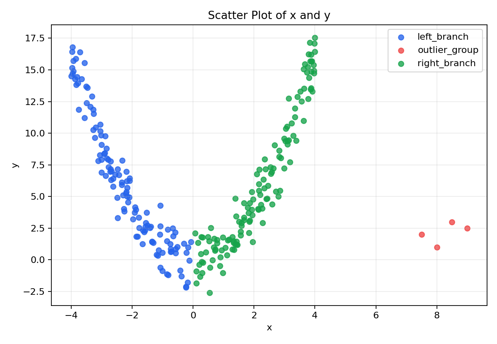
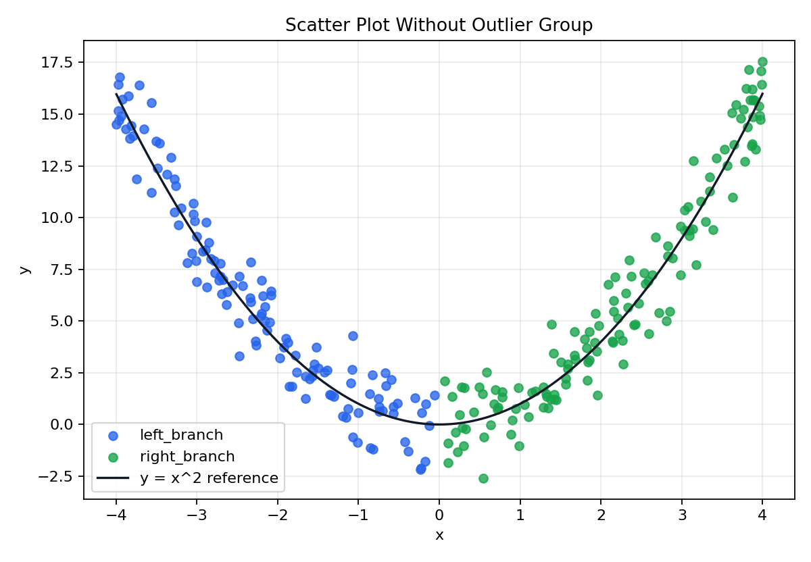
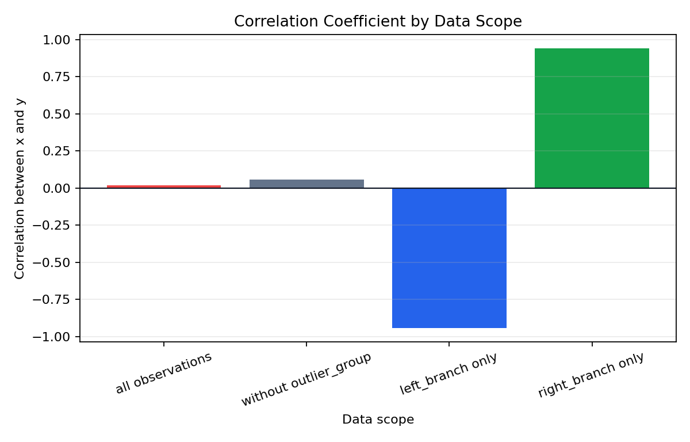

# Problem 10 — Correlation Traps

## Problem Statement

We are given a dataset of 264 observations with two numerical variables \( x \) and \( y \), along with a group label. The data is designed to illustrate a critical lesson in statistics: a correlation coefficient near zero does **not** mean there is no relationship. Our tasks involve computing correlations, removing outliers, comparing results, and providing deep conceptual explanations of when and why correlation fails as a summary statistic.

## Generated Files

- Dataset: [`problem_10_correlation_traps.csv`](problem_10_correlation_traps/problem_10_correlation_traps.csv)
- Dataset without outlier group: [`problem_10_without_outlier_group.csv`](problem_10_correlation_traps/problem_10_without_outlier_group.csv)
- Outlier observations: [`outlier_group_observations.csv`](problem_10_correlation_traps/outlier_group_observations.csv)
- Correlation summary: [`correlation_summary.csv`](problem_10_correlation_traps/correlation_summary.csv)
- Group summary: [`summary_by_group.csv`](problem_10_correlation_traps/summary_by_group.csv)
- Plots:
  - [`scatter_with_outliers.png`](problem_10_correlation_traps/scatter_with_outliers.png)
  - [`scatter_without_outliers.png`](problem_10_correlation_traps/scatter_without_outliers.png)
  - [`correlation_by_scope.png`](problem_10_correlation_traps/correlation_by_scope.png)

---

## Solution

### Task 1: Describe what one row of the dataset represents

**Answer:**

Each row in `problem_10_correlation_traps.csv` represents a **single observation** consisting of a pair of numerical measurements \( (x, y) \) and a group label. The columns are:

| Column | Type | Description |
| :----- | :--- | :---------- |
| `observation_id` | string | A unique identifier (e.g., `N0001`) |
| `x` | float | The first numerical variable |
| `y` | float | The second numerical variable |
| `group` | categorical | The group to which the observation belongs: `left_branch`, `right_branch`, or `outlier_group` |

For example, the row `N0001, -2.157, 5.015, left_branch` represents an observation with \( x = -2.157 \) and \( y = 5.015 \), belonging to the left branch of the data.

The dataset contains **264 observations** in total:
- **125** in the `left_branch` (negative \( x \) values)
- **135** in the `right_branch` (positive \( x \) values)
- **4** in the `outlier_group` (high \( x \) values, low \( y \) values)

The group structure is critical to understanding the data: the left and right branches together form a **U-shaped (parabolic) pattern**, while the outlier group consists of 4 points far from the main pattern.

---

### Task 2: Draw a scatter plot of x and y

**Answer:**

The scatter plot of all 264 observations reveals the hidden structure of the data:

```python
import matplotlib.pyplot as plt

colors = df['group'].map({
    'left_branch': 'blue',
    'right_branch': 'green',
    'outlier_group': 'red'
})
plt.scatter(df['x'], df['y'], c=colors, alpha=0.6, edgecolors='black', linewidths=0.5)
plt.xlabel('x')
plt.ylabel('y')
plt.title('Scatter Plot: x vs y (All Observations)')
plt.savefig('scatter_with_outliers.png', dpi=150)
```



**What we see in the scatter plot:**

1. **A clear U-shaped (parabolic) pattern:** The main body of the data follows a relationship resembling \( y \approx x^2 \). For negative values of \( x \), \( y \) increases as \( x \) becomes more negative. For positive values of \( x \), \( y \) increases as \( x \) becomes more positive.

2. **Two symmetric branches:** The left branch (\( x < 0 \)) shows a strong **negative linear trend** — as \( x \) decreases (becomes more negative), \( y \) increases. The right branch (\( x > 0 \)) shows a strong **positive linear trend** — as \( x \) increases, \( y \) increases.

3. **Four outlier points:** At approximately \( x \in [7.5, 9.0] \) and \( y \in [1.0, 3.0] \), there are 4 observations far from the main parabolic pattern.

After removing the outlier group, the structure is even clearer:



---

### Task 3: Compute the correlation coefficient between x and y

**Answer:**

The **Pearson correlation coefficient** between \( x \) and \( y \) is defined as:

$$
r_{xy} = \frac{\sum_{i=1}^{n}(x_i - \bar{x})(y_i - \bar{y})}{\sqrt{\sum_{i=1}^{n}(x_i - \bar{x})^2 \cdot \sum_{i=1}^{n}(y_i - \bar{y})^2}}
$$

This measures the strength and direction of the **linear** relationship between the two variables. It takes values in \( [-1, +1] \):
- \( r = +1 \): perfect positive linear relationship
- \( r = -1 \): perfect negative linear relationship
- \( r = 0 \): no linear relationship

Computing for **all 264 observations**:

```python
r_all = df['x'].corr(df['y'])
# r_all = 0.0179
```

$$
r_{xy}^{(\text{all})} = 0.0179
$$

**This is essentially zero.** A naïve interpretation would be: "There is no relationship between \( x \) and \( y \)." As we will see, this interpretation is profoundly wrong.

The near-zero correlation arises because the dataset has a **symmetric nonlinear structure**. The negative correlation in the left branch and the positive correlation in the right branch **cancel each other out** when all data are pooled together:

$$
r_{xy}^{(\text{all})} \approx 0 \quad \text{because} \quad r_{xy}^{(\text{left})} \approx -0.94 \quad \text{and} \quad r_{xy}^{(\text{right})} \approx +0.94
$$

---

### Task 4: Remove the observations from the outlier group

**Answer:**

The outlier group contains exactly **4 observations**:

| Observation ID | \( x \) | \( y \) | Group |
| :------------- | ------: | ------: | :---- |
| N0261          | 7.5     | 2.0     | outlier_group |
| N0262          | 8.0     | 1.0     | outlier_group |
| N0263          | 8.5     | 3.0     | outlier_group |
| N0264          | 9.0     | 2.5     | outlier_group |

These points have **unusually high** \( x \) values (ranging from 7.5 to 9.0, while the regular data spans roughly \( [-4, +4] \)) and **unusually low** \( y \) values (ranging from 1.0 to 3.0, while for \( |x| \approx 4 \) the regular data has \( y \approx 16 \)).

```python
df_clean = df[df['group'] != 'outlier_group']
# 264 - 4 = 260 observations remain
```

The outlier group summary statistics are:
- Mean \( x \): 8.25
- Mean \( y \): 2.125
- These points are dramatically distant from the main data pattern

If the data follows \( y \approx x^2 \), then at \( x = 8.25 \) we would expect \( y \approx 68 \), not \( y \approx 2 \). These are extreme outliers by any measure.

After removal, we have **260 observations** consisting of the left branch (125) and right branch (135).

---

### Task 5: Compute the correlation coefficient again (without outliers)

**Answer:**

After removing the 4 outlier observations, we recompute the Pearson correlation:

```python
r_clean = df_clean['x'].corr(df_clean['y'])
# r_clean = 0.0572
```

$$
r_{xy}^{(\text{no outliers})} = 0.0572
$$

This is still very close to zero. Removing the outliers changed the correlation from 0.0179 to 0.0572 — a small shift.

Additionally, we can compute correlations **within each branch**:

| Data Scope | Observation Count | Correlation \( r_{xy} \) |
| :--------- | ----------------: | -----------------------: |
| All observations | 264 | 0.0179 |
| Without outlier group | 260 | 0.0572 |
| Left branch only | 125 | −0.9428 |
| Right branch only | 135 | 0.9405 |



The within-branch correlations are stunning: **−0.9428** for the left branch and **+0.9405** for the right branch. These are among the strongest correlations one can observe in real-world-like data. Yet when combined, they produce a correlation of essentially zero.

---

### Task 6: Compare the two correlation values

**Answer:**

Let us place the two overall correlations side by side:

| Metric | With Outliers | Without Outliers | Difference |
| :----- | ------------: | ---------------: | ---------: |
| Correlation \( r_{xy} \) | 0.0179 | 0.0572 | +0.0393 |
| Observation count | 264 | 260 | −4 |

**Quantitative comparison:**

The absolute change is:

$$
\Delta r = r_{xy}^{(\text{no outliers})} - r_{xy}^{(\text{all})} = 0.0572 - 0.0179 = 0.0393
$$

The relative change is:

$$
\frac{\Delta r}{r_{xy}^{(\text{all})}} = \frac{0.0393}{0.0179} \approx 2.20
$$

So the correlation more than **tripled** (from 0.0179 to 0.0572) by removing just 4 out of 264 observations — that is, removing only \( \frac{4}{264} \approx 1.5\% \) of the data.

**Why the change occurred:**

The 4 outlier points have very high \( x \) values (mean = 8.25) combined with very low \( y \) values (mean = 2.125). In the context of the regular data (where high \( |x| \) corresponds to high \( y \)), these outlier points create a slight **negative pull** on the overall correlation. When they are removed, the correlation shifts slightly upward.

**However, the deeper lesson is not about the magnitude of this shift.** Both 0.0179 and 0.0572 are essentially zero. The real story is that neither value captures the true structure of the data — a **strong nonlinear relationship** with within-branch correlations of ±0.94. The single correlation coefficient is simply the wrong tool for this data.

---

### Task 7: Explain why correlation may fail to describe a nonlinear relationship

**Answer:**

The **Pearson correlation coefficient** is designed to measure **linear** association — it quantifies how well the data can be described by a straight line \( y = a + bx \). Mathematically:

$$
r_{xy} = \frac{\text{Cov}(X,Y)}{\sigma_X \sigma_Y} = \frac{E[(X - \mu_X)(Y - \mu_Y)]}{\sigma_X \sigma_Y}
$$

The covariance in the numerator sums terms \( (x_i - \bar{x})(y_i - \bar{y}) \). For a **linear** relationship, these terms consistently have the same sign (positive for positive slope, negative for negative slope), producing a large \( |r| \).

For a **nonlinear relationship** like the U-shape \( y \approx x^2 \), the terms systematically cancel:

- When \( x < 0 \): increasing \( x \) toward 0 decreases \( y \), so \( (x_i - \bar{x}) \) and \( (y_i - \bar{y}) \) often have opposite signs → **negative** contributions to the covariance.
- When \( x > 0 \): increasing \( x \) away from 0 increases \( y \), so \( (x_i - \bar{x}) \) and \( (y_i - \bar{y}) \) often have the same sign → **positive** contributions.

These positive and negative contributions approximately cancel, resulting in:

$$
\text{Cov}(X, Y) \approx 0 \quad \Rightarrow \quad r_{xy} \approx 0
$$

In our dataset, this is exactly what happens:
- Left branch: \( r = -0.9428 \) (strong negative linear trend)
- Right branch: \( r = +0.9405 \) (strong positive linear trend)
- Combined: \( r = 0.0572 \) (cancellation)

**Other examples of nonlinear relationships where correlation fails:**

| Relationship | Equation | Expected \( r \) |
| :----------- | :------- | :-----------: |
| Parabola | \( y = x^2 \) | ≈ 0 |
| Circle | \( x^2 + y^2 = 1 \) | = 0 |
| Sine wave | \( y = \sin(x) \) | ≈ 0 |
| Exponential (symmetric domain) | \( y = e^{-x^2} \) | ≈ 0 |

In all these cases, a strong deterministic relationship exists, but the correlation coefficient is unable to detect it because it only "sees" the linear component.

**What to use instead:** For nonlinear relationships, consider:
- **Rank-based correlations** (Spearman's \( \rho \), Kendall's \( \tau \)) — these capture monotonic (but not necessarily linear) relationships
- **Mutual information** — a measure from information theory that captures any form of dependence
- **Distance correlation** — guarantees zero if and only if the variables are truly independent
- Most importantly, **scatter plots** — the visual inspection that reveals what no single number can

---

### Task 8: Explain why low correlation doesn't mean no relationship

**Answer:**

This is perhaps the most important statistical misconception to correct. The statement **"correlation equals zero implies no relationship"** is **false**. More precisely:

> **Independence implies zero correlation, but zero correlation does NOT imply independence.**

The correct logical relationship is:

$$
X \perp Y \quad \Rightarrow \quad r_{XY} = 0
$$

but the converse:

$$
r_{XY} = 0 \quad \not\Rightarrow \quad X \perp Y
$$

**Why?** Because the Pearson correlation only measures **linear** dependence. Two variables can be strongly related through a nonlinear function and still have zero correlation. Our dataset provides a perfect example:

- \( r_{xy} = 0.0572 \) (without outliers) — essentially zero
- Yet the scatter plot shows an **unmistakable U-shaped pattern** with \( R^2 \) close to 1 when fitting a quadratic model \( y = ax^2 + bx + c \)

**Another way to see this:** If we know \( x \), we can predict \( y \) with high accuracy (using \( y \approx x^2 \)). The variables are far from independent. Yet the correlation coefficient claims there is "no relationship."

**Concrete scenario:** Imagine you are a manager looking at this data. If you only computed the correlation and saw \( r = 0.06 \), you might conclude that \( x \) is useless for predicting \( y \). But if you looked at the scatter plot, you would immediately see that \( x \) is an **excellent** predictor of \( y \) — you just need a nonlinear model.

**The lesson:** Always plot your data. Summary statistics can hide crucial patterns. As Anscombe's Quartet famously demonstrated (Anscombe, 1973), very different datasets can produce identical summary statistics — including identical correlations.

---

### Task 9: Explain how outliers can distort correlation

**Answer:**

Outliers can have a disproportionate effect on the Pearson correlation because the formula involves **squared deviations** from the mean. A single extreme point can pull the correlation substantially toward +1 or −1 (or push it toward 0).

**Mechanism of distortion:**

The Pearson correlation can be written as:

$$
r_{xy} = \frac{\sum_{i=1}^{n}(x_i - \bar{x})(y_i - \bar{y})}{\sqrt{\sum_{i=1}^{n}(x_i - \bar{x})^2} \cdot \sqrt{\sum_{i=1}^{n}(y_i - \bar{y})^2}}
$$

An outlier with extreme values of both \( x \) and \( y \) contributes a large term \( (x_{\text{out}} - \bar{x})(y_{\text{out}} - \bar{y}) \) to the numerator. Depending on the **sign** of this term relative to the rest of the data, it can either inflate or deflate the correlation.

**In our dataset:**

The 4 outlier points have:
- High \( x \): mean = 8.25 (far above the overall mean)
- Low \( y \): mean = 2.125 (below the overall mean of about 6)

This creates **negative cross-products** \( (x_i - \bar{x})(y_i - \bar{y}) < 0 \), which **push the correlation downward**. That is why:

$$
r_{\text{all}} = 0.0179 < r_{\text{no outliers}} = 0.0572
$$

The outliers introduced a negative bias. Removing just 4 points (1.5% of the data) changed the correlation by:

$$
\Delta r = +0.0393
$$

**Classic examples of outlier distortion:**

1. **A single outlier creating a false correlation:** Imagine 100 points with \( r \approx 0 \). Adding one point at \( (100, 100) \) can make \( r \) jump to 0.5 or higher.

2. **A single outlier destroying a real correlation:** Imagine 100 points with \( r \approx 0.9 \). Adding one point at \( (100, -100) \) can drag \( r \) down toward 0.

3. **Our dataset:** The outliers slightly pull the already-near-zero correlation even closer to zero.

**Robustness alternatives:**

Because Pearson correlation is sensitive to outliers, robust alternatives include:
- **Spearman's rank correlation** — uses ranks instead of raw values, making it resistant to outliers
- **Winsorized correlation** — replaces extreme values with less extreme ones before computing
- **Median-based measures** — such as the median absolute deviation for spread

**The bottom line:** Before interpreting a correlation coefficient, always check for outliers. A few extreme points can make the number unreliable.

---

### Task 10: Describe what can be seen in the scatter plot but not from correlation alone

**Answer:**

The scatter plot reveals at least **five important features** that the correlation coefficient alone completely hides:

#### 1. The Nonlinear (U-shaped) Relationship

The most striking feature is the clear **parabolic pattern** \( y \approx x^2 \). This is a strong, deterministic-looking relationship. The correlation coefficient of 0.0572 gives zero indication that this relationship exists.

#### 2. The Two-Branch Structure

The data naturally separates into two branches:
- **Left branch** (\( x < 0 \), 125 observations): strong negative linear trend (\( r = -0.9428 \))
- **Right branch** (\( x > 0 \), 135 observations): strong positive linear trend (\( r = +0.9405 \))

The correlation for the combined data washes out both of these strong within-branch relationships.

#### 3. The Symmetry of the Pattern

The scatter plot shows an approximately **symmetric** pattern around \( x = 0 \). The left and right branches are near-mirror images. This symmetry is precisely what causes the cancellation in the correlation formula. No summary statistic captures this symmetry as clearly as the plot.

#### 4. The Outlier Group

The 4 outlier points at \( x \in [7.5, 9.0] \), \( y \in [1.0, 3.0] \) are immediately visible in the scatter plot as **isolated points** far from the main pattern. They stand out both because of their unusual \( x \) range and because they break the expected \( y \approx x^2 \) relationship. From the correlation coefficient alone, you would never know these outliers exist.

#### 5. The Range and Spread of the Data

The scatter plot shows us that:
- \( x \) ranges from about −4 to +4 for regular data (and up to 9 for outliers)
- \( y \) ranges from about −3 to +18 for regular data
- The spread of \( y \) increases with \( |x| \) — this is **heteroscedasticity** (non-constant variance)

The group summary confirms this quantitatively:

| Group | Observation Count | Mean \( x \) | Mean \( y \) | Min \( x \) | Max \( x \) | Min \( y \) | Max \( y \) |
| :---- | ----------------: | -----------: | -----------: | ----------: | ----------: | ----------: | ----------: |
| left_branch | 125 | −2.1482 | 5.9510 | −3.995 | −0.063 | −2.163 | 16.804 |
| right_branch | 135 | 2.1446 | 6.0978 | 0.069 | 3.998 | −2.595 | 17.557 |
| outlier_group | 4 | 8.2500 | 2.1250 | 7.500 | 9.000 | 1.000 | 3.000 |

#### The Fundamental Lesson

A scatter plot is an **information-rich** visualization — it shows every data point and lets the human eye detect patterns, clusters, outliers, nonlinearities, and heteroscedasticity simultaneously. The correlation coefficient, by contrast, is an **information-poor** summary — it compresses all of this into a single number between −1 and +1.

This is why best practice in data analysis always prescribes:

> **Plot first. Compute second. Interpret with both.**

The correlation coefficient is useful when the relationship is known to be approximately linear, with no extreme outliers, and from a single homogeneous population. When any of these assumptions are violated — as they are spectacularly in this problem — the correlation can be dangerously misleading.

---

## Summary and Key Takeaways

This problem demonstrates one of the most important lessons in statistics: **summary statistics can hide critical structure in data**. The Pearson correlation coefficient between \( x \) and \( y \) is 0.0179 (or 0.0572 without outliers) — values that suggest "no relationship." Yet the scatter plot reveals a powerful U-shaped relationship with within-branch correlations exceeding ±0.94.

Three key traps were illustrated: **(1) Nonlinear relationships** produce near-zero correlations despite strong functional dependence. **(2) Simpson's paradox in correlation** — subgroup correlations (−0.94 and +0.94) can cancel to produce a near-zero aggregate correlation. **(3) Outliers** can distort correlation, even when they comprise only 1.5% of the data.

The overarching takeaway is that **visualization is not optional** in data analysis. No single number can substitute for looking at your data. As the great statistician John Tukey wrote: *"The greatest value of a picture is when it forces us to notice what we never expected to see."*
